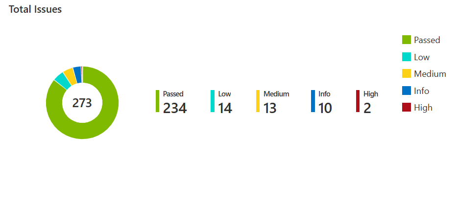
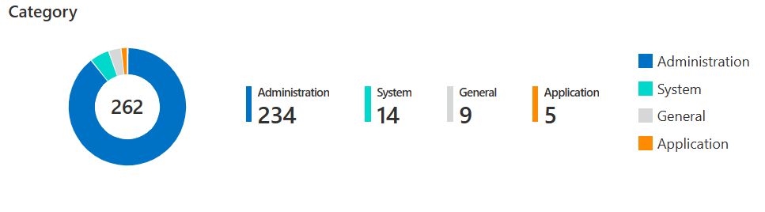
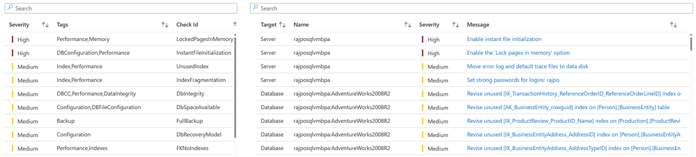
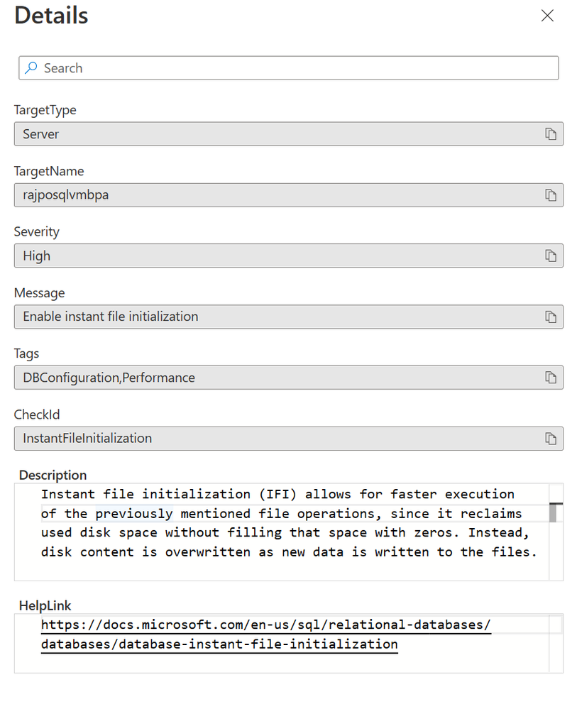
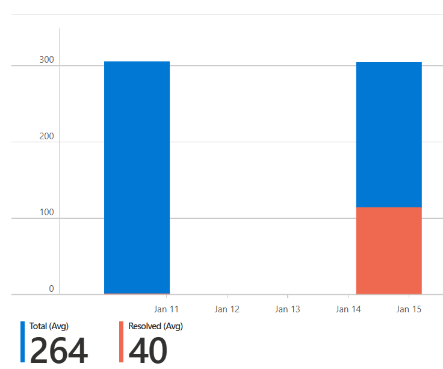

# Best Practices Assessment for SQL Server enabled by Azure Arc

This guide explains how to enable, run, and review the Best Practices Assessment (BPA) for Arc-enabled SQL Server. BPA evaluates your SQL Server instances and databases and provides prioritized recommendations to improve security, reliability, and performance.

## Overview

- BPA is available for SQL Server instances with license type Paid (Software Assurance/subscription) or PAYG. Instances set to LicenseOnly must be changed before enabling BPA.
- Windows-only at this time; Linux instances aren’t supported.
- Assessments run at the machine scope and include all SQL Server instances and databases on that host.
- Default schedule runs weekly (Sunday, 12:00 AM local time). You can also run on‑demand.

## Prerequisites

- Arc-enabled SQL Server on Windows with the Azure extension for SQL Server:
	- Single instance: WindowsAgent.SqlServer version 1.1.2202.47 or later
	- Multiple instances: version later than 1.1.2231.59
- Log Analytics workspace in the same subscription as the Arc-enabled SQL Server resource
- For named instances, SQL Server Browser service must be running
- Permissions (minimum typical):
	- To configure: Log Analytics Contributor on the workspace scope, Azure Connected Machine Resource Administrator on the Arc SQL resource scope, and Monitoring Contributor on both the workspace and Arc-enabled machine scopes. Contributor/Owner also works.
	- To view results: Reader on the Arc SQL resource scope, Log Analytics Reader on the workspace scope, and Monitoring Reader on the workspace scope.
- Network/agent:
	- Allow outbound TCP 443 to: `global.handler.control.monitor.azure.com`, `*.handler.control.monitor.azure.com`, `<workspaceId>.ods.opinsights.azure.com`, `*.ingest.monitor.azure.com`
	- Azure Monitor Agent (AMA) is used for BPA. If AMA is already installed, existing proxy settings are reused. If installed by BPA, proxy isn’t auto-configured—re‑deploy AMA to set a proxy.

## Enable BPA (portal)

1. Open Azure portal > Azure Arc > SQL Server instances and select your Arc-enabled SQL Server resource.
2. In the left menu, select Best practices assessment.
3. Choose a Log Analytics workspace from the same subscription.
4. Select Enable assessment and wait for completion.
5. Confirm the schedule (default every Sunday 12:00 AM). You can adjust later under Configuration.

Media (from Microsoft TechCommunity):
- 
- 
- 
- 
- 

## Enable at scale (Azure Policy)

Use the built-in policy: “Configure Arc-enabled Servers with SQL Server extension installed to enable or disable SQL best practices assessment”.

Portal steps:
1. Azure Policy > Definitions > search for the policy above.
2. Assign to the desired scope (subscription or resource group).
3. Parameters: select Log Analytics workspace and location; set Enablement = true.
4. Remediation: create a remediation task; prefer system-assigned managed identity.
5. Review + Create.

Notes
- If the workspace is in a different resource group than the SQL resource, assign the policy at subscription scope.
- Don’t change extension configuration while remediation is running; monitor task progress in Azure Policy.

PowerShell guide: see enable-at-scale.md for a two-RG pattern and a ready-to-run script.

## Manage and run assessments

- Run on-demand: Best practices assessment > Run assessment (results may take up to ~2 hours to appear in Logs).
- Configure schedule: Best practices assessment > Configuration > Schedule assessment.
- Disable: Best practices assessment > Configuration > Disable assessment.

## View results

- Tabs: All, New, Resolved, Insights; use filters (Name, Severity, Check Id) and Export to Excel.
- Severity categories: High, Medium, Low, Information, Passed. Start with High.
- Drilldown grids show recommendations and per‑instance impact; each item links to detailed guidance.
- Trends: charts for all/new/resolved issues across runs help you track progress.

## KQL examples (Log Analytics)

Open Logs from the results pane to query assessment data across your workspace(s). Example from the blog—find servers missing “Lock pages in memory”:

```
let selectedCategories = dynamic([]);
let selectedTotSev = dynamic([]);
SqlAssessment_CL
| extend asmt = parse_csv(RawData)
| extend CheckId = tostring(asmt[2]),
				 TargetType = case(asmt[6] == 1, "Server", asmt[6] == 2, "Database", ""),
				 TargetName = tostring(asmt[7]),
				 Sev = toint(asmt[8]),
				 Severity = case(Sev == 30, "High", Sev == 20, "Medium", Sev == 10, "Low", "Information"),
				 Message = tostring(asmt[9]),
				 TagsArr = split(tostring(asmt[10]), ",")
| where CheckId == "LockedPagesInMemory"
| project TargetType, TargetName, Severity, CheckId, Message
| distinct TargetType, TargetName, Severity, CheckId, Message
```

## Considerations

- License requirement: BPA supports Paid and PAYG; not available for LicenseOnly. Use the portal to change license type if needed.
- CPU overhead: an assessment run can add up to ~10% CPU depending on environment size and workload; schedule accordingly.
- History may take a short time to populate after enabling.

## Troubleshooting

- Review required roles and workspace access if enablement fails or results don’t appear.
- Verify AMA presence and proxy connectivity to required endpoints listed above.
- See the [official troubleshooting guide](https://learn.microsoft.com/en-us/sql/sql-server/azure-arc/troubleshoot-assessment?view=sql-server-ver17).

## Related documentation

- [Configure best practices assessment](https://learn.microsoft.com/en-us/sql/sql-server/azure-arc/assess?view=sql-server-ver17&tabs=portal)
- [Azure Monitor Agent proxy configuration](https://learn.microsoft.com/en-us/azure/azure-monitor/agents/azure-monitor-agent-data-collection-endpoint?tabs=ArmPolicy#proxy-configuration)
- [Manage configuration (license types)](https://learn.microsoft.com/en-us/sql/sql-server/azure-arc/manage-configuration?view=sql-server-ver17)
- [Arc-enabled SQL Server overview](https://learn.microsoft.com/en-us/sql/sql-server/azure-arc/overview?view=sql-server-ver17)
