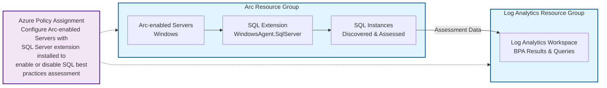

# Enable Best Practices Assessment at scale (Azure Policy + PowerShell)

This guide enables Best Practices Assessment (BPA) for many Arc-enabled SQL Server instances using a single Azure Policy assignment. It uses two resource groups: one for Arc resources and one dedicated to a Log Analytics workspace.

## Table of Contents
- [Overview](#overview)
- [Quick Start](#quick-start)
- [Architecture](#architecture)
- [Important Notes](#important-notes)
- [Prerequisites](#prerequisites)
- [Steps (PowerShell)](#steps-powershell)
- [Verification and Remediation](#verification-and-remediation)
- [Monitoring and Management](#monitoring-and-management)
- [Considerations](#considerations)
- [References](#references)

## Overview

Best Practices Assessment provides automated recommendations for:
- SQL Server and database configurations
- Index management  
- Deprecated features
- Enabled or missing trace flags
- Statistics

**Assessment duration**: Few minutes to an hour (depending on environment size)  
**Performance impact**: Up to 10% CPU during assessment runs  
**Default schedule**: Every Sunday at 12:00 AM local time

## Quick Start

1. **Validate prerequisites**: Ensure Windows-only SQL instances with Paid/PAYG licensing
2. **Test with dry-run**: Use the validation script below to test parameters
3. **Deploy at scale**: Use Azure Policy to enable BPA across multiple servers
4. **Monitor compliance**: Review Azure Policy compliance and remediation status

> **⚠️ Important**: Always test with dry-run mode first!

## Architecture



## Important Notes

> **Licensing**: BPA supports SQL Server license types **Paid** or **PAYG** only. LicenseOnly isn't supported.
> 
> **Platform**: Windows-only; Linux instances aren't supported.
> 
> **Policy Scope**: If the workspace is in a different resource group than the SQL resources (recommended separation), assign the policy at **subscription scope**.

## Prerequisites

### Licensing Requirements
- **Required license types**: Paid or PAYG only
- **Not supported**: LicenseOnly instances must be changed first
- See [Configure SQL Server enabled by Azure Arc](https://learn.microsoft.com/en-us/sql/sql-server/azure-arc/manage-configuration?view=sql-server-ver17) for license type changes

### System Requirements
- **Operating System**: Windows only (Linux instances not supported)
- **Azure Extension for SQL Server** minimum versions:
  - Single instance: ≥ 1.1.2202.47
  - Multi-instance: > 1.1.2231.59
- **SQL Server Browser**: Must be running for named instances
- **NT AUTHORITY\SYSTEM**: Must be member of sysadmin role on all SQL instances
- **TCP/IP**: Must be enabled on SQL Server instances

### Azure Requirements
- **Log Analytics workspace**: Same subscription as Arc-enabled SQL Server resources
- **Azure Monitor Agent (AMA)**: Automatically installed if needed (proxy settings not auto-configured)

### Required Permissions

**For policy assignment**:
- **Resource Policy Contributor** role at target scope (subscription/resource group)
- **User Access Administrator** role (if creating user-assigned identity)

**For configuration**:
- **Log Analytics Contributor** role on workspace resource group/subscription
- **Azure Connected Machine Resource Administrator** role on Arc-enabled server resource group/subscription  
- **Monitoring Contributor** role on both Log Analytics and Arc machine resource groups/subscriptions

**For viewing results**:
- **Reader** role on SQL Server - Azure Arc resource
- **Log Analytics Reader** role on workspace
- **Monitoring Reader** role on workspace resource group/subscription

### Network Requirements
Outbound TCP 443 access to:
- `global.handler.control.monitor.azure.com`
- `*.handler.control.monitor.azure.com`  
- `<workspaceId>.ods.opinsights.azure.com`
- `*.ingest.monitor.azure.com`

> **Note**: If using proxy servers, configure AMA proxy settings separately. BPA doesn't set proxy settings automatically.

## Steps (PowerShell)

Replace placeholders in angle brackets and run in an elevated PowerShell session with Az modules installed.

### Step 1: Validate with Dry-run (Recommended)

**Test your parameters first** (validates without creating resources):
```powershell
# DRY RUN: BPA At-Scale Enablement - Validation Only
param([switch]$Execute = $false)

if (-not $Execute) {
    Write-Host "=== DRY RUN MODE - No resources will be created ===" -ForegroundColor Yellow
    Write-Host "Use -Execute to run with actual resource creation`n" -ForegroundColor Gray
}

# 0) Sign in and select subscription
if (-not $Execute) { Write-Host "WOULD RUN: Connect-AzAccount" -ForegroundColor Cyan }
else { Connect-AzAccount | Out-Null }

$subscriptionId = '<subscription-id>'  # Replace with actual subscription ID
if (-not $Execute) { Write-Host "WOULD RUN: Set-AzContext -Subscription $subscriptionId" -ForegroundColor Cyan }
else { Set-AzContext -Subscription $subscriptionId | Out-Null }

# 1) Create resource groups (separate RGs for Arc resources and LA workspace)
$location = '<region>'                # e.g., westus, westeurope, swedencentral
$arcRg    = '<arc-resources-rg>'      # e.g., rg-arc-sql-prod
$laRg     = '<log-analytics-rg>'      # e.g., rg-ops-logs

if (-not $Execute) {
    Write-Host "WOULD CREATE: Resource Group '$arcRg' in '$location'" -ForegroundColor Cyan
    Write-Host "WOULD CREATE: Resource Group '$laRg' in '$location'" -ForegroundColor Cyan
} else {
    New-AzResourceGroup -Name $arcRg -Location $location -ErrorAction SilentlyContinue | Out-Null
    New-AzResourceGroup -Name $laRg  -Location $location -ErrorAction SilentlyContinue | Out-Null
}

# 2) Create Log Analytics workspace
$laName = '<workspace-name>'          # e.g., la-arc-sql-bpa
if (-not $Execute) {
    Write-Host "WOULD CREATE: Log Analytics Workspace '$laName' in RG '$laRg'" -ForegroundColor Cyan
    # Simulate workspace details for dry run
    $laId = "/subscriptions/$subscriptionId/resourceGroups/$laRg/providers/Microsoft.OperationalInsights/workspaces/$laName"
    $laLocation = $location
} else {
    New-AzOperationalInsightsWorkspace -ResourceGroupName $laRg -Name $laName -Location $location -Sku PerGB2018 -ErrorAction SilentlyContinue | Out-Null
    # Capture workspace details
    $la = Get-AzOperationalInsightsWorkspace -ResourceGroupName $laRg -Name $laName
    $laId = $la.ResourceId
    $laLocation = $la.Location
}

Write-Host "✓ Workspace ID: $laId" -ForegroundColor Green
Write-Host "✓ Workspace Location: $laLocation" -ForegroundColor Green

# 3) Locate the built-in policy definition by display name
Write-Host "`nLooking up BPA policy definition..." -ForegroundColor Yellow
$policyDisplayNamePattern = 'Configure Arc-enabled Servers with SQL Server extension installed to enable or disable SQL best practices assessment'
if (-not $Execute) {
    Write-Host "WOULD RUN: Get-AzPolicyDefinition | Where-Object DisplayName matches pattern" -ForegroundColor Cyan
    Write-Host "✓ Policy lookup: SIMULATED SUCCESS" -ForegroundColor Green
} else {
    $policyDefinition = Get-AzPolicyDefinition | Where-Object { $_.Properties.DisplayName -match [regex]::Escape($policyDisplayNamePattern) }
    if (-not $policyDefinition) { throw "Policy definition not found: $policyDisplayNamePattern" }
    Write-Host "✓ Found policy: $($policyDefinition.Properties.DisplayName)" -ForegroundColor Green
    # (Optional) Inspect parameter names to confirm keys
    $policyDefinition.Properties.Parameters.GetEnumerator() | Select-Object Name, Value | Format-Table -AutoSize
}

# 4) Assign the policy (use subscription scope when RGs differ)
$scope = "/subscriptions/$subscriptionId"
$policyAssignmentName = 'SQLBestPracticesAssessmentAssignment'

$parameters = @{
  laWorkspaceId       = $laId
  laWorkspaceLocation = $laLocation
  isEnabled           = $true       # set $false to disable assessment
}

Write-Host "`nPolicy Assignment Details:" -ForegroundColor Yellow
Write-Host "  Name: $policyAssignmentName" -ForegroundColor Gray
Write-Host "  Scope: $scope" -ForegroundColor Gray
Write-Host "  Parameters:" -ForegroundColor Gray
$parameters.GetEnumerator() | ForEach-Object {
    Write-Host "    $($_.Key): $($_.Value)" -ForegroundColor DarkGray
}

if (-not $Execute) {
    Write-Host "`nWOULD CREATE: Policy Assignment with System-Assigned Identity" -ForegroundColor Cyan
} else {
    New-AzPolicyAssignment -Name $policyAssignmentName `
      -DisplayName 'Enable SQL Best Practices Assessment (Arc-enabled SQL)' `
      -PolicyDefinition $policyDefinition `
      -Scope $scope `
      -PolicyParameterObject $parameters `
      -IdentityType 'SystemAssigned' `
      -Location $location | Out-Null
}

# 5) Verify assignment
if (-not $Execute) {
    Write-Host "`nWOULD VERIFY: Get-AzPolicyAssignment -Name $policyAssignmentName -Scope $scope" -ForegroundColor Cyan
    Write-Host "`n✓ DRY RUN COMPLETED SUCCESSFULLY" -ForegroundColor Green
    Write-Host "All parameters validated. Ready for execution with -Execute flag." -ForegroundColor Gray
} else {
    Write-Host "`nVerifying policy assignment..." -ForegroundColor Yellow
    Get-AzPolicyAssignment -Name $policyAssignmentName -Scope $scope | Format-List Name, Scope, EnforcementMode
    Write-Host "`n✓ EXECUTION COMPLETED SUCCESSFULLY" -ForegroundColor Green
}
```

### Step 2: Execute for Production

**Production version** (creates actual resources):
```powershell
# 0) Sign in and select subscription
Connect-AzAccount | Out-Null
$subscriptionId = '<subscription-id>'
Set-AzContext -Subscription $subscriptionId | Out-Null

# 1) Create resource groups (separate RGs for Arc resources and LA workspace)
$location = '<region>'                # e.g., westus, westeurope, swedencentral
$arcRg    = '<arc-resources-rg>'      # e.g., rg-arc-sql-prod
$laRg     = '<log-analytics-rg>'      # e.g., rg-ops-logs

New-AzResourceGroup -Name $arcRg -Location $location -ErrorAction SilentlyContinue | Out-Null
New-AzResourceGroup -Name $laRg  -Location $location -ErrorAction SilentlyContinue | Out-Null

# 2) Create Log Analytics workspace
$laName = '<workspace-name>'          # e.g., la-arc-sql-bpa
New-AzOperationalInsightsWorkspace -ResourceGroupName $laRg -Name $laName -Location $location -Sku PerGB2018 -ErrorAction SilentlyContinue | Out-Null

# Capture workspace details
$la = Get-AzOperationalInsightsWorkspace -ResourceGroupName $laRg -Name $laName
$laId = $la.ResourceId
$laLocation = $la.Location

# 3) Locate the built-in policy definition by display name
# Tip: Use -match to avoid punctuation/spacing edge cases
$policyDisplayNamePattern = 'Configure Arc-enabled Servers with SQL Server extension installed to enable or disable SQL best practices assessment'
$policyDefinition = Get-AzPolicyDefinition | Where-Object { $_.Properties.DisplayName -match [regex]::Escape($policyDisplayNamePattern) }

if (-not $policyDefinition) { throw "Policy definition not found: $policyDisplayNamePattern" }

# (Optional) Inspect parameter names to confirm keys
$policyDefinition.Properties.Parameters.GetEnumerator() | Select-Object Name, Value | Format-Table -AutoSize

# 4) Assign the policy (use subscription scope when RGs differ)
$scope = "/subscriptions/$subscriptionId"    # or a resource group scope if workspace and SQL are in the same RG
$policyAssignmentName = 'SQLBestPracticesAssessmentAssignment'

# Typical parameter keys are shown below; confirm with the inspection above if needed.
$parameters = @{
  laWorkspaceId       = $laId
  laWorkspaceLocation = $laLocation
  isEnabled           = $true       # set $false to disable assessment
}

New-AzPolicyAssignment -Name $policyAssignmentName `
  -DisplayName 'Enable SQL Best Practices Assessment (Arc-enabled SQL)' `
  -PolicyDefinition $policyDefinition `
  -Scope $scope `
  -PolicyParameterObject $parameters `
  -IdentityType 'SystemAssigned' `
  -Location $location | Out-Null

# 5) Verify assignment
Get-AzPolicyAssignment -Name $policyAssignmentName -Scope $scope | Format-List Name, Scope, EnforcementMode
```

## Verification and remediation

### Policy Compliance
- In **Azure Policy**, review **Compliance** for the assignment
- Allow time for evaluation and remediation (can take several minutes)
- Track remediation progress: **Azure Policy > Assignments > [Your Assignment] > Remediation**

### Common Issues
- **LicenseOnly instances**: Change license type to Paid or PAYG first
- **Extension conflicts**: Don't change extension configuration while remediation is running
- **Permissions**: Verify all required roles are assigned

### Assessment Results Timeline
- **Assessment completion**: Few minutes to 1 hour (depending on environment)
- **Results availability**: Up to 2 hours after assessment completion
- **Default schedule**: Every Sunday at 12:00 AM local time

## Monitoring and Management

### Viewing Results
After BPA is enabled, you can:
- **Run on-demand assessment**: From the portal's "Best practices assessment" pane
- **View results**: Available 2 hours after assessment completion
- **Schedule changes**: Modify assessment frequency as needed
- **Disable assessment**: Use Configuration > Disable assessment

### Log Analytics Queries
Access assessment data directly in Log Analytics workspace. See [Best practices assessment blog post](https://techcommunity.microsoft.com/t5/sql-server-blog/best-practices-assessment-arc-enabled-sql-server/ba-p/3715776) for sample queries.

## Considerations

- **Performance impact**: Up to 10% CPU during assessment runs
- **Windows only**: Assessment doesn't work for SQL Server on Linux
- **History loading**: May take a few seconds to populate previous execution history
- **Policy remediation**: Don't make extension changes while Azure Policy is remediating resources

## References

### Official Documentation
- [Configure best practices assessment (PowerShell and portal)](https://learn.microsoft.com/en-us/sql/sql-server/azure-arc/assess?view=sql-server-ver17#enable-best-practices-assessment-at-scale-by-using-azure-policy)
- [Manage configuration (license types)](https://learn.microsoft.com/en-us/sql/sql-server/azure-arc/manage-configuration?view=sql-server-ver17)
- [Troubleshooting guide](https://learn.microsoft.com/en-us/sql/sql-server/azure-arc/troubleshoot-assessment?view=sql-server-ver17)
- [Azure Policy documentation](https://learn.microsoft.com/en-us/azure/governance/policy)

### Technical Resources
- [AMA proxy configuration](https://learn.microsoft.com/en-us/azure/azure-monitor/agents/azure-monitor-agent-data-collection-endpoint?tabs=ArmPolicy#proxy-configuration)
- [Assessment API: 500 rules](https://github.com/microsoft/sql-server-samples/blob/master/samples/manage/sql-assessment-api/DefaultRuleset.csv)
- [Best practices assessment blog post](https://techcommunity.microsoft.com/t5/sql-server-blog/best-practices-assessment-arc-enabled-sql-server/ba-p/3715776)

### Related Arc SQL Features
- [View inventory](https://learn.microsoft.com/en-us/sql/sql-server/azure-arc/view-inventory?view=sql-server-ver17)
- [Microsoft Unified](https://www.microsoft.com/en-us/microsoft-unified)
