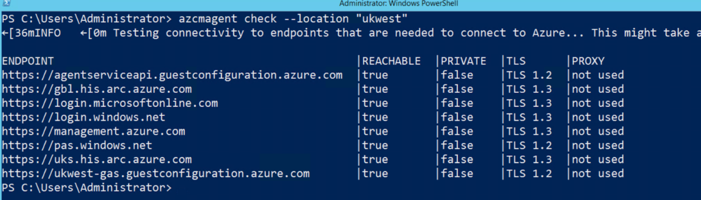
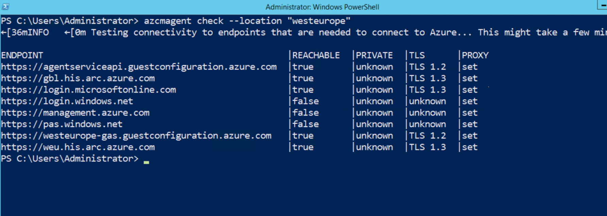

# Network Connectivity for Azure Arc

Version: v1.2025.12  
Last updated: 2025-12-16

## Overview

The Azure Connected Machine agent communicates from your non-Azure environment to Azure using
several URLs. If outbound connectivity is restricted by a firewall or proxy, you must allow the
required endpoints.

For the full list of required URLs, see the
[official network requirements][learn-network].

## When to use

- Before onboarding servers to Azure Arc, to validate network readiness
- When troubleshooting connectivity issues with Arc-enabled servers
- After firewall or proxy changes, to confirm endpoints remain reachable

## Prerequisites

- Azure Connected Machine agent installed on the server
- PowerShell or Command Prompt access on the server
- Knowledge of your Azure region (e.g., `eastus`, `westeurope`)

## Quick start

Run the built-in connectivity check:

```powershell
azcmagent check --location "<your-region>"
```

The output shows whether each required endpoint is reachable.

[learn-network]: https://learn.microsoft.com/azure/azure-arc/servers/network-requirements

At the very minimum, the agent needs to be able to communicate with URLs such as:

* *.guestconfiguration.azure.com (Extension management and guest configuration services)
* *his.arc.azure.com (Metadata and Hybrid Identity Service)
* login.microsoftonline.com (Microsoft Entra ID)
* login.windows.net (Microsoft Entra ID)
* pas.windows.net (Microsoft Entra ID)
* management.azure.com (Azure Resource Manager)

To check if network connectivity for the Azure Connected Machine agent is blocked you can use the [azcmagent CLI tool](https://learn.microsoft.com/en-us/azure/azure-arc/servers/manage-agent).

The azcmagent CLI is installed with the Azure Connected Machine agent and controls actions specific to the server where it's running.

One of the switches available with the azcmagent is `check`. This runs a series of network connectivity checks to see if the agent can successfully communicate with required network endpoints.

## Check Azure Arc connectivity using public endpoints

To use the azcmagent CLI tool log onto a server that has the Azure Connected Machine agent installed on it.

Launch a command prompt or PowerShell terminal window.

Type in
```powershell
azcmagent check --location "ukwest"
```

The command outputs a table showing connectivity test results for each required endpoint. In this example, all URLs are reachable and are going directly to the URLs.



> [!NOTE]
> If you are using a different Azure region, ensure you input the correct name.
> Run `az account list-locations -o table` to get a list of region names.

## Check Azure Arc connectivity using private endpoints

If you are using private endpoints for connectivity you can use the following command to check:

```powershell
azcmagent check --location "useast" --enable-pls-check
```

> [!NOTE]
> If you are using a different Azure region, ensure you input the correct name.
> Run `az account list-locations -o table` to get a list of region names.

## Check Azure Arc connectivity using a proxy

If you are using a proxy to route traffic the command you would check network connectivity is the same as if you are using public endpoints.

```powershell
azcmagent check --location "westeurope"
```



In this example, you can see from the table the traffic is going through a proxy server and some of the URLs are unreachable.

## Conclusion

In conclusion, ensuring seamless connectivity for the Azure Connected Machine agent is crucial for a successful onboarding process to Azure Arc.

This involves verifying the accessibility of specific URLs through either public or private endpoints, with additional considerations for environments employing proxy servers.

Utilizing the azcmagent CLI tool provides a straightforward means to conduct network connectivity checks, allowing users to address any potential restrictions or blockages, and ensuring a smooth integration of servers into the Azure Arc ecosystem.

---

*Originally published at [techielass.com](https://techielass.com)*

*Author: [Sarah Lean 🏴󠁧󠁢󠁳󠁣󠁴󠁿](https://dev.to/techielass)*