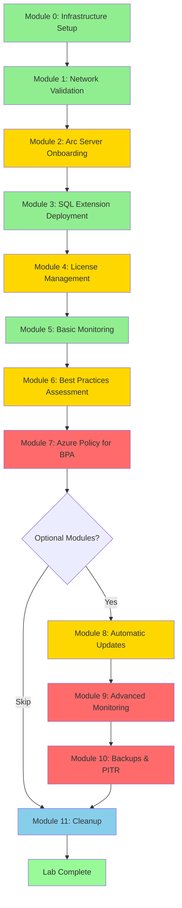

# Azure Arc-Enabled SQL Server - Hands-On Lab

**Duration:** 2 hours (Core) + 70 minutes (Optional)  
**Level:** Intermediate  
**Target Audience:** IT Professionals, System Administrators, Cloud Architects

---

## 📑 Table of Contents

### Getting Started
- [Overview](#overview)
- [Lab Architecture](#lab-architecture)
- [What You Will Learn](#what-you-will-learn)
- [Prerequisites](#prerequisites)
- [Progress Tracker](#progress-tracker)
- [Quick Command Reference](#quick-command-reference)
- [Lab Flow Diagram](#lab-flow-diagram)

### Core Modules (2h 15m)
- [Module 0: Infrastructure Setup (15 min)](#module-0-infrastructure-setup-15-minutes) - 🟢 Beginner
- [Module 1: Network Connectivity Validation (10 min)](#module-1-network-connectivity-validation-10-minutes) - 🟢 Beginner
- [Module 2: Azure Arc Server Onboarding (20 min)](#module-2-azure-arc-server-onboarding-20-minutes) - 🟡 Intermediate
- [Module 3: SQL Server Extension Deployment (15 min)](#module-3-sql-server-extension-deployment--auto-discovery-15-minutes) - 🟢 Beginner
- [Module 4: License Type Management (20 min)](#module-4-license-type-management-20-minutes) - 🟡 Intermediate
- [Module 5: Basic Monitoring Setup (15 min)](#module-5-basic-monitoring-setup-15-minutes) - 🟢 Beginner
- [Module 6: Best Practices Assessment (20 min)](#module-6-best-practices-assessment-20-minutes) - 🟡 Intermediate
- [Module 7: Azure Policy for BPA (25 min)](#module-7-azure-policy-for-bpa-at-scale-25-minutes) - 🔴 Advanced

### Optional Advanced Modules (+70m)
- [Module 8: Configure Automatic Updates (10 min)](#module-8-optional-configure-automatic-updates-10-minutes) - 🟡 Intermediate | ⚠️ Preview
- [Module 9: Advanced SQL Monitoring (20 min)](#module-9-optional-advanced-sql-monitoring-preview-20-minutes) - 🔴 Advanced | ⚠️ Preview
- [Module 10: Automated Backups & PITR (40 min)](#module-10-optional-configure-automated-backups--point-in-time-restore-preview-40-minutes) - 🔴 Advanced | ⚠️ Preview

### Wrap-Up
- [Module 11: Lab Cleanup (10 min)](#module-11-lab-cleanup-10-minutes)
- [Troubleshooting](#troubleshooting)
- [Additional Resources](#additional-resources)
- [Feedback and Support](#feedback-and-support)

**Legend:** 🟢 Beginner | 🟡 Intermediate | 🔴 Advanced | ⚠️ Preview Feature

---

## Overview

This comprehensive hands-on lab guides you through the complete lifecycle of managing SQL Server instances with Azure Arc. You will learn how to onboard on-premises SQL Server instances to Azure Arc, manage licensing, enable monitoring, implement best practices assessment, and leverage Azure Policy for governance at scale.

### Lab Architecture


### What You Will Learn

**Core Modules:**
- Deploy Azure infrastructure for Arc-enabled SQL Server using Bicep
- Validate network connectivity requirements for Azure Arc
- Onboard on-premises SQL Server to Azure Arc
- Configure automatic SQL instance discovery
- Manage license types (PAYG, Paid/Software Assurance)
- Transition between license types
- Enable and configure SQL Server monitoring
- Implement Best Practices Assessment (BPA)
- Deploy Azure Policy for BPA at scale

**Optional Advanced Modules (Preview Features):**
- Configure automatic Windows and SQL Server updates
- Enable advanced performance monitoring with DMV metrics
- Set up automated backups with custom retention policies
- Perform point-in-time database restores

**All Modules:**
- Clean up and deprovision resources

### Prerequisites

#### Azure Requirements
- Active Azure subscription with **Owner** permissions
- No pre-existing resource groups (you will create your own)
- Resource providers registered: `Microsoft.HybridCompute`, `Microsoft.AzureArcData`, `Microsoft.OperationalInsights`

#### On-Premises Environment
- **Windows Server**: 2022 or higher
- **SQL Server**: 2017 or higher (Standard or Enterprise edition)
- SQL Server **already installed and licensed**
- Local administrator access to the server
- Network connectivity to Azure (outbound HTTPS on TCP port 443)

#### Tools & Software
- **PowerShell**: 7.0 or higher
- **Azure PowerShell Module**: Latest version
  ```powershell
  Install-Module -Name Az -AllowClobber -Force
  ```
- **Azure CLI** (optional): Latest version
- **Bicep CLI**: Latest version
  ```powershell
  az bicep install
  ```

**Knowledge Prerequisites**
- Basic understanding of SQL Server administration
- Familiarity with PowerShell scripting
- Basic knowledge of Azure concepts (resource groups, subscriptions)
- Understanding of Azure Resource Manager (ARM) and Bicep

---

## 📋 Progress Tracker

Track your progress through the lab by checking off completed modules:

**Core Modules**
- [ ] Module 0: Infrastructure Setup
- [ ] Module 1: Network Connectivity Validation
- [ ] Module 2: Azure Arc Server Onboarding
- [ ] Module 3: SQL Server Extension Deployment
- [ ] Module 4: License Type Management
- [ ] Module 5: Basic Monitoring Setup
- [ ] Module 6: Best Practices Assessment
- [ ] Module 7: Azure Policy for BPA

**Optional Advanced Modules**
- [ ] Module 8: Configure Automatic Updates
- [ ] Module 9: Advanced SQL Monitoring
- [ ] Module 10: Automated Backups & PITR

**Wrap-Up**
- [ ] Module 11: Lab Cleanup

---

## ⚡ Quick Command Reference

<details>
<summary><b>Click to expand essential commands</b></summary>

### Infrastructure Deployment
```powershell
# Deploy Bicep infrastructure
cd bicep
.\deploy.ps1 -BaseName "arcsql-lab" -Environment "dev"
```

### Arc Server Onboarding
```powershell
# Install Arc agent
msiexec /i "$env:TEMP\AzureConnectedMachineAgent.msi" /qn

# Connect to Azure Arc
& "$env:ProgramW6432\AzureConnectedMachineAgent\azcmagent.exe" connect `
    --service-principal-id <APP_ID> `
    --service-principal-secret <SECRET> `
    --tenant-id <TENANT_ID> `
    --subscription-id <SUB_ID> `
    --resource-group "arcsql-lab-arc-rg" `
    --location "swedencentral"

# Check status
& "$env:ProgramW6432\AzureConnectedMachineAgent\azcmagent.exe" show
```

### SQL Extension Management
```powershell
# Deploy SQL Server extension
New-AzConnectedMachineExtension `
    -ResourceGroupName "arcsql-lab-arc-rg" `
    -MachineName "<SERVER_NAME>" `
    -Name "WindowsAgent.SqlServer" `
    -Publisher "Microsoft.AzureData" `
    -ExtensionType "WindowsAgent.SqlServer" `
    -Location "swedencentral" `
    -EnableAutomaticUpgrade
```

### License Management
```powershell
# Set license to PAYG
Update-AzSqlInstanceArc `
    -ResourceGroupName "arcsql-lab-arc-rg" `
    -Name "<SQL_ARC_NAME>" `
    -LicenseType "PAYG"

# Set license to Paid (Software Assurance)
Update-AzSqlInstanceArc `
    -ResourceGroupName "arcsql-lab-arc-rg" `
    -Name "<SQL_ARC_NAME>" `
    -LicenseType "Paid"
```

### Monitoring & Backups (Optional Preview Features)
```powershell
# Enable advanced monitoring
az resource update `
    --ids "/subscriptions/<SUB>/resourceGroups/<RG>/providers/Microsoft.AzureArcData/SqlServerInstances/<NAME>" `
    --set 'properties.monitoring.enabled=true' `
    --api-version 2023-09-01-preview

# Configure backup policy
az sql server-arc backups-policy create `
    --name "<SQL_ARC_NAME>" `
    --resource-group "arcsql-lab-arc-rg" `
    --retention-days 14 `
    --full-backup-days 7 `
    --diff-backup-hours 24 `
    --tlog-backup-mins 5
```

### Cleanup
```powershell
# Disconnect and cleanup
& "$env:ProgramW6432\AzureConnectedMachineAgent\azcmagent.exe" disconnect --force-local-only
Remove-AzResourceGroup -Name "arcsql-lab-arc-rg" -Force
Remove-AzResourceGroup -Name "arcsql-lab-monitoring-rg" -Force
```

</details>

---

## 🔄 Lab Flow Diagram



**Color Legend:** 🟢 Beginner (Green) | 🟡 Intermediate (Yellow) | 🔴 Advanced (Red) | 🔵 Cleanup (Blue)

---

## Lab Modules

### Core Modules

### Module 0: Infrastructure Setup (15 minutes)

> **📦 MODULE SUMMARY**  
> **Duration:** 15 minutes | **Difficulty:** 🟢 Beginner  
> **What you'll do:** Deploy Azure resource groups and Log Analytics workspace using Bicep  
> **Key outcomes:** Infrastructure ready for Arc resources and monitoring  
> **Prerequisites:** Azure subscription with Owner permissions, Bicep CLI installed

Deploy the required Azure infrastructure using Bicep templates.

**Objectives:**
- Deploy resource groups for Arc resources and monitoring
- Create Log Analytics workspace for monitoring and BPA
- Register required resource providers

**Steps:**

1. **Clone the repository** (if you haven't already):
   ```powershell
   git clone https://github.com/microsoft/azure-arc-enabled-sql-server.git
   cd azure-arc-enabled-sql-server/arc-sql-hands-on-lab
   ```

2. **Review the Bicep templates**:
   - `bicep/main.bicep` - Main deployment template
   - `bicep/modules/log-analytics.bicep` - Log Analytics workspace

3. **Deploy the infrastructure**:
   ```powershell
   cd bicep
   
   # Connect to Azure
   Connect-AzAccount
   
   # Set your subscription (replace with your subscription ID)
   Set-AzContext -SubscriptionId "<your-subscription-id>"
   
   # Deploy the template
   .\deploy.ps1 -BaseName "arcsql-lab" -Environment "dev"
   ```

4. **Verify deployment**:
   - Check the Azure portal for the two resource groups:
     - `arcsql-lab-arc-rg` (for Arc resources)
     - `arcsql-lab-monitoring-rg` (for Log Analytics workspace)

**Validation:**
- ✅ Two resource groups created in Sweden Central
- ✅ Log Analytics workspace deployed with SQL Assessment solution
- ✅ Deployment outputs saved to `deployment-outputs.json`

---

**[⬆️ Back to Top](#-table-of-contents)** | **[➡️ Next: Module 1 - Network Validation](#module-1-network-connectivity-validation-10-minutes)**

---

### Module 1: Network Connectivity Validation (10 minutes)

> **📦 MODULE SUMMARY**  
> **Duration:** 10 minutes | **Difficulty:** 🟢 Beginner  
> **What you'll do:** Test connectivity to Azure Arc endpoints and validate DNS resolution  
> **Key outcomes:** Confirmed network connectivity for Arc agent communication  
> **Prerequisites:** PowerShell access on on-premises server

Validate that your on-premises server can communicate with Azure Arc endpoints.

**Objectives:**
- Verify outbound connectivity to required Azure endpoints
- Test DNS resolution for Arc services
- Validate firewall and proxy configuration

**Steps:**

1. **Run the network connectivity test**:
   ```powershell
   cd ../scripts
   .\Test-ArcConnectivity.ps1 -Region "swedencentral" -Verbose
   ```

2. **Review the connectivity report**:
   - Check all required endpoints are accessible
   - Verify DNS resolution is working
   - Confirm no proxy issues

3. **Remediate any connectivity issues**:
   - If using a proxy, configure `https_proxy` environment variable
   - Ensure firewall allows outbound HTTPS (port 443) to Azure endpoints
   - Validate `*.swedencentral.arcdataservices.com` is accessible

**Required Endpoints:**
- `management.azure.com`
- `login.microsoftonline.com`
- `*.guestconfiguration.azure.com`
- `*.his.arc.azure.com`
- `*.swedencentral.arcdataservices.com`

**Validation:**
- ✅ All Azure Arc endpoints are accessible
- ✅ DNS resolution working for all required domains
- ✅ No connectivity errors reported

---

**[⬅️ Previous: Module 0 - Infrastructure](#module-0-infrastructure-setup-15-minutes)** | **[⬆️ Back to Top](#-table-of-contents)** | **[➡️ Next: Module 2 - Arc Onboarding](#module-2-azure-arc-server-onboarding-20-minutes)**

---

### Module 2: Azure Arc Server Onboarding (20 minutes)

> **📦 MODULE SUMMARY**  
> **Duration:** 20 minutes | **Difficulty:** 🟡 Intermediate  
> **What you'll do:** Create Service Principal, install Arc agent, connect server to Azure  
> **Key outcomes:** On-premises server visible in Azure portal as Arc-enabled server  
> **Prerequisites:** Azure subscription, local admin access, network connectivity validated

Connect your on-premises Windows Server to Azure Arc using Service Principal authentication.

**Objectives:**
- Create Service Principal for Arc onboarding
- Grant required permissions to Service Principal
- Install Azure Connected Machine agent using Service Principal
- Register the server with Azure Arc
- Verify server appears in Azure portal

**Steps:**

#### Part A: Create Service Principal (5 minutes)

1. **Run the service principal creation script** on your **workstation** (not the on-premises server):
   ```powershell
   cd scripts
   .\Create-ArcServicePrincipal.ps1 `
       -ServicePrincipalName "Arc-SQL-Lab-Onboarding-SP" `
       -Scope "Subscription"
   ```

2. **Securely save the output credentials**:
   - **Application ID** (appId)
   - **Secret** (password) - This is sensitive!
   - **Tenant ID**
   - **Subscription ID**
   
   **Important**: The secret is displayed only once and saved to `service-principal-credentials.json`. Store these credentials securely (e.g., Azure Key Vault, password manager) and delete the JSON file afterward.

3. **Understand the role assignment**:
   - Role: **Azure Connected Machine Onboarding**
   - Scope: Subscription-level
   - Permissions: Minimum required to onboard servers to Arc
   - Service Principal is used ONLY during onboarding, not for ongoing management

#### Part B: Onboard Server to Arc (15 minutes)

1. **Download the Azure Connected Machine agent** on your on-premises server:
   - Visit: https://aka.ms/AzureConnectedMachineAgent
   - Or use PowerShell:
   ```powershell
   # On the on-premises server
   $ProgressPreference = 'SilentlyContinue'
   Invoke-WebRequest -Uri "https://aka.ms/AzureConnectedMachineAgent" `
       -OutFile "$env:TEMP\AzureConnectedMachineAgent.msi"
   ```

2. **Install the agent** on your on-premises server:
   ```powershell
   # Run in elevated PowerShell on the on-premises server
   msiexec /i "$env:TEMP\AzureConnectedMachineAgent.msi" /qn /l*v "$env:TEMP\InstallationLog.txt"
   ```

3. **Connect the server to Azure Arc using Service Principal**:
   
   Replace the placeholders with your actual values from the service principal creation:
   
   ```powershell
   # Set variables (replace with your actual values)
   $servicePrincipalAppId = "<Application-ID-from-previous-step>"
   $servicePrincipalSecret = "<Secret-from-previous-step>"
   $tenantId = "<Tenant-ID-from-previous-step>"
   $subscriptionId = "<Subscription-ID-from-previous-step>"
   $resourceGroup = "arcsql-lab-arc-rg"
   $location = "swedencentral"
   
   # Connect to Azure Arc
   & "$env:ProgramW6432\AzureConnectedMachineAgent\azcmagent.exe" connect `
       --service-principal-id $servicePrincipalAppId `
       --service-principal-secret $servicePrincipalSecret `
       --tenant-id $tenantId `
       --subscription-id $subscriptionId `
       --resource-group $resourceGroup `
       --location $location
   ```

4. **Verify agent installation**:
   ```powershell
   # Check agent status
   & "$env:ProgramW6432\AzureConnectedMachineAgent\azcmagent.exe" show
   ```
   
   Expected output should show:
   - Agent Status: **Connected**
   - Azure Resource Name
   - Resource Group
   - Subscription ID

5. **Verify in Azure portal**:
   - Navigate to **Azure Arc** > **Infrastructure** > **Servers**
   - Confirm your server appears with status **Connected**
   - Review server properties (OS, location, agent version)

**Why Service Principal Instead of Interactive Login?**
- ✅ **Automation-friendly**: No user interaction required
- ✅ **Enterprise-ready**: Suitable for at-scale deployments
- ✅ **Security**: Principle of least privilege with limited permissions
- ✅ **Auditable**: All actions traced to service principal
- ✅ **Repeatable**: Can be used for multiple servers

**Validation:**
- ✅ Service Principal created with Azure Connected Machine Onboarding role
- ✅ Credentials stored securely
- ✅ Azure Connected Machine agent installed successfully
- ✅ Server visible in Azure portal under Arc > Servers
- ✅ Server status shows as **Connected**
- ✅ Server resource in `arcsql-lab-arc-rg` resource group
- ✅ Agent reports status when running `azcmagent show`

---

**[⬅️ Previous: Module 1 - Network Validation](#module-1-network-connectivity-validation-10-minutes)** | **[⬆️ Back to Top](#-table-of-contents)** | **[➡️ Next: Module 3 - SQL Extension](#module-3-sql-server-extension-deployment--auto-discovery-15-minutes)**

---

### Module 3: SQL Server Extension Deployment & Auto-Discovery (15 minutes)

> **📦 MODULE SUMMARY**  
> **Duration:** 15 minutes | **Difficulty:** 🟢 Beginner  
> **What you'll do:** Deploy SQL Server extension and verify SQL instance auto-discovery  
> **Key outcomes:** SQL Server instances visible in Azure Arc portal  
> **Prerequisites:** Arc server connected (Module 2), SQL Server installed

Deploy the Azure extension for SQL Server and enable automatic SQL instance discovery.

**Objectives:**
- Understand automatic SQL discovery process
- Deploy Azure extension for SQL Server
- Verify SQL instances are discovered and registered
- Review SQL Server resources in Azure

**Steps:**

1. **Understand auto-discovery**:
   - When a server is connected to Arc, SQL instances are automatically discovered
   - The `WindowsAgent.SqlServer` extension is deployed automatically
   - SQL Server - Azure Arc resources are created for each instance

2. **Verify automatic extension deployment**:
   - Navigate to your Arc-enabled server in the portal
   - Go to **Extensions** tab
   - Look for **WindowsAgent.SqlServer** extension
   - Status should be **Succeeded**

3. **If extension was NOT auto-deployed**, manually deploy it:
   ```powershell
   # Get your Arc server resource
   $serverName = "<your-server-name>"
   $resourceGroup = "arcsql-lab-arc-rg"
   
   # Deploy SQL Server extension
   New-AzConnectedMachineExtension `
       -ResourceGroupName $resourceGroup `
       -MachineName $serverName `
       -Name "WindowsAgent.SqlServer" `
       -Publisher "Microsoft.AzureData" `
       -ExtensionType "WindowsAgent.SqlServer" `
       -Location "swedencentral" `
       -EnableAutomaticUpgrade
   ```

4. **Verify SQL Server instances discovered**:
   - Navigate to **Azure Arc** > **Data services** > **SQL Server instances**
   - Confirm your SQL Server instance(s) appear
   - Note the resource group and region (same as Arc server)

5. **Review SQL Server resource properties**:
   - Click on a SQL Server instance
   - Review **Overview** page
   - Note: Edition, Version, vCores, License Type (initially "Configuration needed")

**Validation:**
- ✅ WindowsAgent.SqlServer extension deployed and running
- ✅ SQL Server instance(s) visible in Azure Arc > SQL Server instances
- ✅ Instance details showing edition, version, and configuration
- ✅ No deployment errors in extension status

---

### Module 4: License Type Management (20 minutes)

Configure and transition between different SQL Server license types.

**Objectives:**
- Understand SQL Server licensing options in Azure Arc
- Configure initial license type (PAYG)
- Transition to Paid (Software Assurance/Azure Hybrid Benefit)
- Understand billing implications

**Steps:**

#### Part A: Configure PAYG (Pay-As-You-Go) License

1. **Navigate to your SQL Server instance** in Azure portal:
   - **Azure Arc** > **Data services** > **SQL Server instances**
   - Select your instance

2. **Configure PAYG licensing**:
   - Go to **Configuration** blade
   - Under **License type**, select **Pay-as-you-go**
   - Review the pricing information
   - Click **Save**

3. **Verify configuration**:
   - Confirm license type updated to **Pay-as-you-go**
   - Check the **Billing information** section

#### Part B: Transition to Paid (Software Assurance)

Since your SQL Server is already licensed with Software Assurance, transition to the Paid license type to unlock advanced features.

1. **Update license type to Paid**:
   - Navigate to **Configuration** blade
   - Change **License type** to **Paid** (License with Software Assurance or SQL subscription)
   - Click **Save**

2. **Verify advanced features are now available**:
   - Check that **Best Practices Assessment** is now configurable
   - Verify **Monitoring** features are enabled

#### Part C: Using PowerShell for License Management

For managing licenses at scale:

```powershell
# Set license type to PAYG
$resourceGroup = "arcsql-lab-arc-rg"
$sqlServerArcName = "<your-sql-server-arc-resource-name>"

Update-AzSqlInstanceArc `
    -ResourceGroupName $resourceGroup `
    -Name $sqlServerArcName `
    -LicenseType "PAYG"

# Set license type to Paid (Software Assurance)
Update-AzSqlInstanceArc `
    -ResourceGroupName $resourceGroup `
    -Name $sqlServerArcName `
    -LicenseType "Paid"
```

**Understanding License Types:**

| License Type | Description | Features | Billing |
|-------------|-------------|----------|---------|
| **PAYG** | Pay-as-you-go subscription | Full features, no upfront license cost | Hourly billing based on vCores |
| **Paid** | License with Software Assurance | Full features, use existing licenses | No SQL license charges, only management services |
| **LicenseOnly** | Bring your own license (no SA) | Limited features, basic management only | No charges |

**Validation:**
- ✅ Successfully configured PAYG license type
- ✅ Successfully transitioned to Paid license type
- ✅ License type reflected correctly in Azure portal
- ✅ Advanced features (BPA, Monitoring) now available

---

### Module 5: Basic Monitoring Setup (15 minutes)

Enable basic monitoring for your Arc-enabled SQL Server instance.

**Objectives:**
- Understand monitoring capabilities for Arc-enabled SQL Server
- Enable basic monitoring features
- Review monitoring dashboards
- Understand data collection

**Steps:**

1. **Verify monitoring prerequisites**:
   - SQL Server version 2016 SP1 or later
   - License type: **Paid** or **PAYG** (not LicenseOnly)
   - Extension version 1.1.2504.99 or later

2. **Enable monitoring** (if not already enabled):
   - Navigate to your SQL Server Arc resource
   - Go to **Monitoring** blade
   - If monitoring is not enabled, follow the prompts to enable it

3. **Review available monitoring dashboards**:
   - **Performance Dashboard**: View CPU, memory, I/O metrics
   - **Database Inventory**: See all databases on the instance
   - **SQL Server Overview**: Instance-level metrics and health

4. **Understand data collection**:
   - Monitoring data is collected automatically
   - Performance metrics sent to Azure every 5 minutes
   - No Log Analytics workspace integration required for basic monitoring

5. **Explore monitoring data**:
   - Go to **Monitoring** > **Performance**
   - Select different time ranges
   - Review CPU, memory, and I/O trends

**Note:** Advanced monitoring configuration (custom queries, alerts, dashboards) is out of scope for this lab.

**Validation:**
- ✅ Monitoring enabled on SQL Server Arc resource
- ✅ Performance dashboards displaying data
- ✅ Database inventory visible
- ✅ No monitoring errors reported

---

### Module 6: Best Practices Assessment (20 minutes)

Enable and run SQL Server Best Practices Assessment to identify configuration improvements.

**Objectives:**
- Enable Best Practices Assessment (BPA)
- Configure BPA to use Log Analytics workspace
- Run an assessment
- Review assessment results and recommendations

**Steps:**

1. **Verify BPA prerequisites**:
   - License type: **Paid** or **PAYG**
   - Windows operating system (BPA not supported on Linux)
   - Log Analytics workspace deployed (from Module 0)

2. **Enable BPA from Azure portal**:
   - Navigate to your SQL Server Arc resource
   - Go to **Best practices assessment** blade
   - Click **Configure**
   - Select:
     - **Log Analytics workspace**: `arcsql-lab-law-<unique>`
     - **Assessment schedule**: Weekly (Sunday, 12:00 AM)
   - Click **Enable**

3. **Run an immediate assessment**:
   - On the **Best practices assessment** blade
   - Click **Run assessment now**
   - Wait for assessment to complete (5-15 minutes depending on DB count)

4. **Review assessment results**:
   - Once complete, review the **Assessment results** page
   - Results are categorized by:
     - **Severity**: High, Medium, Low, Informational
     - **Category**: Configuration, Performance, Security, etc.
   - Click on individual recommendations to see:
     - Detailed description
     - Impact analysis
     - Remediation steps
     - Links to documentation

5. **Export assessment results** (optional):
   - Click **Export** to download results as CSV or JSON
   - Use for reporting or tracking remediation progress

**Understanding BPA Results:**

BPA evaluates your SQL Server configuration against Microsoft best practices:
- **Configuration**: SQL Server and database settings
- **Index Management**: Missing or unused indexes
- **Statistics**: Statistics that need updating
- **Deprecated Features**: Use of deprecated features
- **Trace Flags**: Trace flags that should be enabled/disabled

**Validation:**
- ✅ BPA enabled and configured with Log Analytics workspace
- ✅ Assessment ran successfully
- ✅ Assessment results visible in Azure portal
- ✅ Can view detailed recommendations and remediation steps

---

### Module 7: Azure Policy for BPA at Scale (25 minutes)

> **📦 MODULE SUMMARY**  
> **Duration:** 25 minutes | **Difficulty:** 🔴 Advanced  
> **What you'll do:** Deploy Azure Policy to auto-enable BPA across all SQL Server instances  
> **Key outcomes:** Governance at scale with automated compliance enforcement  
> **Prerequisites:** Module 6 completed, subscription-level permissions

Deploy Azure Policy to automatically enable Best Practices Assessment across multiple SQL Server instances.

**Objectives:**
- Understand Azure Policy for Arc-enabled SQL Server
- Deploy built-in policy for BPA enablement
- Configure policy parameters
- Create remediation tasks
- Verify policy compliance

**Steps:**

#### Part A: Understand the Policy

1. **Review the built-in policy**:
   - Policy name: **Configure Arc-enabled Servers with SQL Server extension installed to enable or disable SQL best practices assessment**
   - Policy ID: `f36de009-cacb-47b3-b936-9c4c9120d064`
   - Effect: `DeployIfNotExists`

2. **Understand policy behavior**:
   - Automatically enables BPA on SQL Server Arc resources
   - Only applies to instances with **Paid** or **PAYG** license types
   - Requires Log Analytics workspace
   - Creates remediation tasks for non-compliant resources

#### Part B: Assign the Policy

1. **Navigate to Azure Policy** in Azure portal:
   - Search for "Policy" in the top search bar
   - Select **Azure Policy**

2. **Find the BPA policy definition**:
   - Go to **Definitions** blade
   - Search for: "Configure Arc-enabled Servers with SQL Server extension"
   - Click on the policy to open details

3. **Assign the policy**:
   - Click **Assign**
   - **Basics** tab:
     - **Scope**: Select your subscription
     - **Exclusions**: None (unless needed)
     - Click **Next**
   
   - **Parameters** tab:
     - **Show only parameters that need input**: Checked
     - **Enablement**: `true` (enable BPA)
     - **Log Analytics workspace**: Select `arcsql-lab-law-<unique>`
     - **Log Analytics workspace location**: `swedencentral`
     - Click **Next**
   
   - **Remediation** tab:
     - **Create a remediation task**: Checked
     - **Managed Identity Type**: System assigned (recommended)
     - **Managed Identity Location**: `swedencentral`
     - Click **Next**
   
   - **Non-compliance messages** tab:
     - Add custom message (optional): "SQL Server Best Practices Assessment must be enabled"
     - Click **Next**
   
   - **Review + Create**:
     - Review all settings
     - Click **Create**

#### Part C: Monitor Policy Compliance

1. **View policy assignment**:
   - Go to **Azure Policy** > **Assignments**
   - Find your BPA policy assignment
   - Click to view details

2. **Check compliance state**:
   - Go to **Compliance** tab
   - Policy evaluation may take 10-30 minutes for initial scan
   - Refresh the page periodically

3. **View non-compliant resources** (if any):
   - Click on the policy assignment
   - Go to **Resource compliance** tab
   - Review any non-compliant SQL Server instances

4. **Monitor remediation task**:
   - Go to **Remediation** blade under Azure Policy
   - Find your BPA policy remediation task
   - Click to view:
     - Remediation status
     - Resources remediated
     - Errors (if any)

5. **Verify BPA enabled on SQL instances**:
   - Navigate to **Azure Arc** > **SQL Server instances**
   - Select an instance
   - Go to **Best practices assessment** blade
   - Confirm BPA is enabled with correct Log Analytics workspace

#### Part D: Testing Policy Enforcement

1. **Simulate policy enforcement** (optional):
   - If you have another SQL Server to onboard, connect it to Arc
   - Policy should automatically enable BPA within 15-30 minutes
   - Verify in the portal that BPA was configured automatically

**Understanding Policy Scope:**

You can assign policies at different scopes:
- **Subscription**: Applies to all Arc SQL resources in the subscription
- **Resource Group**: Applies only to Arc SQL resources in specific resource groups
- **Management Group**: Applies across multiple subscriptions

**Validation:**
- ✅ Azure Policy successfully assigned at subscription scope
- ✅ Policy shows as **Compliant** for existing SQL Server instances
- ✅ Remediation task completed successfully
- ✅ BPA enabled on all applicable SQL Server instances via policy

---

**[⬅️ Previous: Module 6 - Best Practices Assessment](#module-6-best-practices-assessment-20-minutes)** | **[⬆️ Back to Top](#-table-of-contents)** | **[➡️ Next: Module 8 (Optional) - Automatic Updates](#module-8-optional-configure-automatic-updates-10-minutes) or [Module 11 - Cleanup](#module-11-lab-cleanup-10-minutes)**

---

## Optional Advanced Modules

> **⚠️ PREVIEW FEATURES NOTICE**  
> The following modules cover **preview features** subject to [Supplemental Terms of Use for Microsoft Azure Previews](https://azure.microsoft.com/support/legal/preview-supplemental-terms/).  
> These modules are optional and can be skipped if time is limited. They demonstrate advanced capabilities for production-ready Arc-enabled SQL Server management.

---

### Module 8 (Optional): Configure Automatic Updates (10 minutes)

> **📦 MODULE SUMMARY**  
> **Duration:** 10 minutes | **Difficulty:** 🟡 Intermediate | ⚠️ **Preview Feature**  
> **What you'll do:** Configure automatic Windows and SQL Server patching via maintenance schedules  
> **Key outcomes:** Automated patch management for critical and important updates  
> **Prerequisites:** Arc server onboarded, Paid or PAYG license

Enable automatic patching for Windows and SQL Server through Azure Arc.

**Objectives:**
- Configure automatic updates for Arc-enabled SQL Server
- Set maintenance schedule for patch deployment
- Understand update scope and behavior

**Prerequisites:**
- Module 2 completed (Arc server onboarding)
- License type: **Paid** or **PAYG** (not available for LicenseOnly)
- Windows-based server only

**Steps:**

#### Part A: Understand Automatic Updates

Automatic updates for Arc-enabled SQL Server:
- Work at the **OS level** and apply to all SQL Server instances on the host
- Only apply updates marked as **Important** or **Critical**
- Updates occur only during configured maintenance window
- Use Windows Update and Microsoft Update services
- Service packs and non-critical cumulative updates must be installed manually

#### Part B: Configure Updates via Azure Portal

1. **Navigate to your Arc-enabled server**:
   - Go to **Azure Arc** > **Infrastructure** > **Servers**
   - Select your server

2. **Open SQL Server Configuration**:
   - Under **Operations**, select **SQL Server Configuration**
   - Locate the **Update** section

3. **Enable automatic updates**:
   - Toggle **Automatic updates** to **Enable**
   - Configure maintenance schedule:
     - **Maintenance schedule**: Select day (e.g., Sunday)
     - **Maintenance start hour**: Select time (e.g., 02:00)
   - Click **Save**

4. **Verify configuration**:
   - Confirm settings saved successfully
   - Note: First update cycle will occur during next maintenance window

#### Part C: Configure Updates via Azure CLI

Alternatively, configure updates programmatically:

```powershell
# Set variables
$resourceGroup = "arcsql-lab-arc-rg"
$serverName = "<your-arc-server-name>"

# Enable automatic updates with maintenance schedule
# Note: Use Azure Update Manager REST API for configuration
# See: https://learn.microsoft.com/azure/update-manager/manage-arc-enabled-servers-programmatically

# Example: Create maintenance configuration (requires Az.Maintenance module)
Install-Module -Name Az.Maintenance -AllowClobber -Force

# Create maintenance configuration
$maintenanceConfig = New-AzMaintenanceConfiguration `
    -ResourceGroupName $resourceGroup `
    -Name "SQL-Sunday-Updates" `
    -Location "swedencentral" `
    -MaintenanceScope "InGuestPatch" `
    -StartDateTime "2024-11-17 02:00" `
    -Duration "03:00" `
    -RecurEvery "Week Sunday"

# Assign to Arc server
New-AzConfigurationAssignment `
    -ResourceGroupName $resourceGroup `
    -Location "swedencentral" `
    -ResourceName $serverName `
    -ResourceType "Microsoft.HybridCompute/machines" `
    -ProviderName "Microsoft.Maintenance" `
    -ConfigurationAssignmentName "SQL-Updates-Assignment" `
    -MaintenanceConfigurationId $maintenanceConfig.Id
```

#### Part D: Verify Update Configuration

1. **Check extension status**:
   ```powershell
   Get-AzConnectedMachineExtension `
       -ResourceGroupName $resourceGroup `
       -MachineName $serverName `
       | Where-Object {$_.Name -eq "WindowsAgent.SqlServer"}
   ```

2. **Monitor update history**:
   - Navigate to **Server - Azure Arc** resource
   - Go to **Update management** blade
   - View update history and compliance status

**Important Notes:**
- Changing license type to **LicenseOnly** disables automatic updates
- To change license type, first unsubscribe from automatic updates
- Wait ~5 minutes after saving before changing license type

**Troubleshooting:**

<details>
<summary><b>Click to expand troubleshooting guide</b></summary>

| Issue | Solution |
|-------|----------|
| Automatic updates option grayed out | Verify license type is Paid or PAYG |
| Updates not applying | Check maintenance window configuration and server connectivity |
| License type change blocked | Disable automatic updates, wait 5 minutes, then change license type |

</details>

**Additional Resources:**
- [Configure automatic updates - Microsoft Learn](https://learn.microsoft.com/sql/sql-server/azure-arc/update)
- [Azure Update Manager documentation](https://learn.microsoft.com/azure/update-manager/)

**Validation:**
- ✅ Automatic updates enabled via portal
- ✅ Maintenance schedule configured (day and time)
- ✅ Configuration visible in SQL Server Configuration blade
- ✅ Update management shows compliance status

---

### Module 9 (Optional): Advanced SQL Monitoring (Preview) (20 minutes)

> **📦 MODULE SUMMARY**  
> **Duration:** 20 minutes | **Difficulty:** 🔴 Advanced | ⚠️ **Preview Feature**  
> **What you'll do:** Enable DMV-based performance monitoring with 9 dataset types  
> **Key outcomes:** Real-time SQL performance metrics, wait statistics, and session monitoring  
> **Prerequisites:** Paid or PAYG license, SQL Server 2016 SP1+, Extension 1.1.2504.99+

Enable advanced performance monitoring with DMV-based metrics collection and visualization.

**Objectives:**
- Enable advanced SQL Server performance monitoring
- Configure DMV data collection
- Explore Performance Dashboard with detailed metrics
- Understand monitoring datasets and collection intervals

**Prerequisites:**
- Module 4 completed (license configured as Paid or PAYG)
- SQL Server 2016 SP1 or later
- SQL Server Standard or Enterprise edition
- Extension version 1.1.2504.99 or later
- Windows Server 2016 or later
- Connectivity to `*.<region>.arcdataservices.com`

**Important Limitations:**
- ⚠️ Failover Cluster Instances (FCI) not supported
- ⚠️ Windows Server 2012 R2 and older not supported
- ⚠️ Preview feature - subject to change

**Steps:**

#### Part A: Understand Advanced Monitoring

Advanced monitoring for Arc-enabled SQL Server collects:

| Dataset | Collection Frequency | Description |
|---------|---------------------|-------------|
| Active Sessions | 30 seconds | Sessions running requests, blockers, open transactions |
| CPU Utilization | 10 seconds | CPU usage by SQL Server and other processes |
| Memory Utilization | 10 seconds | Memory clerks and consumption |
| Storage I/O | 10 seconds | IOPS, throughput, latency per database file |
| Database Properties | 5 minutes | Config options, encryption, recovery model |
| Database Storage | 1 minute | Data/log file sizes, version store |
| Performance Counters (Common) | 1 minute | Buffer cache, locks, transactions, connections |
| Performance Counters (Detailed) | 1 minute | Wait times, backup throughput, version store |
| Wait Statistics | 10 seconds | Wait types, wait times, resource waits |

Data is sent to Azure telemetry pipeline for near real-time processing (no Log Analytics required for visualization).

#### Part B: Enable Monitoring via Azure Portal

1. **Navigate to SQL Server Arc resource**:
   - Go to **Azure Arc** > **Data services** > **SQL Server instances**
   - Select your SQL Server instance

2. **Access Performance Dashboard**:
   - Select **Performance Dashboard (preview)**
   - If monitoring not enabled, you'll see a configuration prompt

3. **Configure monitoring**:
   - Click **Configure** at the top of the Performance Dashboard
   - On the **Configure monitoring settings** pane:
     - Toggle monitoring to **On**
   - Click **Apply settings**

4. **Wait for data collection**:
   - Initial data may take 5-15 minutes to appear
   - Dashboard auto-refreshes

5. **Explore Performance Dashboard**:
   - **CPU tab**: View SQL vs. system CPU usage over time
   - **Memory tab**: See memory clerk allocations
   - **Storage I/O tab**: Monitor IOPS, throughput, latency by database
   - **Database tab**: Review database properties and storage
   - **Active Sessions tab**: Identify blocking and long-running sessions
   - **Wait Statistics tab**: Analyze wait types (not visualized yet)

#### Part C: Enable/Disable Monitoring via Azure CLI

**Enable monitoring:**

```powershell
# Set variables
$subscriptionId = "<your-subscription-id>"
$resourceGroup = "arcsql-lab-arc-rg"
$sqlServerArcName = "<your-sql-server-arc-name>"

# Enable monitoring
az resource update `
    --ids "/subscriptions/$subscriptionId/resourceGroups/$resourceGroup/providers/Microsoft.AzureArcData/SqlServerInstances/$sqlServerArcName" `
    --set 'properties.monitoring.enabled=true' `
    --api-version 2023-09-01-preview
```

**Disable monitoring:**

```powershell
# Disable monitoring
az resource update `
    --ids "/subscriptions/$subscriptionId/resourceGroups/$resourceGroup/providers/Microsoft.AzureArcData/SqlServerInstances/$sqlServerArcName" `
    --set 'properties.monitoring.enabled=false' `
    --api-version 2023-09-01-preview
```

**Verify monitoring status:**

```powershell
# Get monitoring configuration
az resource show `
    --ids "/subscriptions/$subscriptionId/resourceGroups/$resourceGroup/providers/Microsoft.AzureArcData/SqlServerInstances/$sqlServerArcName" `
    --api-version 2023-09-01-preview `
    --query "properties.monitoring"
```

#### Part D: Analyze Performance Metrics

1. **Review CPU trends**:
   - Identify peak usage periods
   - Compare SQL Server CPU vs. other processes
   - Look for consistent high CPU (>80%)

2. **Analyze memory usage**:
   - Check buffer pool allocation
   - Review memory clerk consumption
   - Identify memory pressure indicators

3. **Investigate storage I/O**:
   - Find high-latency databases
   - Identify IOPS bottlenecks
   - Review throughput patterns

4. **Identify active sessions issues**:
   - Look for blocking chains
   - Find long-running transactions
   - Identify sessions with open transactions

**Understanding Data Privacy:**
- No personal data or customer content is collected
- Only DMV metadata and performance metrics collected
- All data subject to Microsoft privacy policies

**Troubleshooting:**

<details>
<summary><b>Click to expand troubleshooting guide</b></summary>

| Issue | Solution |
|-------|----------|
| Performance Dashboard not loading | Verify all prerequisites met, check extension version |
| No data appearing after 15 minutes | Verify connectivity to `*.arcdataservices.com`, check license type |
| Monitoring toggle disabled | Confirm license type is Paid or PAYG, not LicenseOnly |
| FCI not showing monitoring option | FCIs not supported for monitoring preview |

</details>

**Additional Resources:**
- [Monitor SQL Server enabled by Azure Arc - Microsoft Learn](https://learn.microsoft.com/sql/sql-server/azure-arc/sql-monitoring)
- [System DMVs documentation](https://learn.microsoft.com/sql/relational-databases/system-dynamic-management-views/system-dynamic-management-views)

**Validation:**
- ✅ Advanced monitoring enabled via portal or CLI
- ✅ Performance Dashboard displaying metrics
- ✅ Multiple dataset tabs populated with data
- ✅ Data refreshing automatically
- ✅ Can view historical trends (time range selector)

---

### Module 10 (Optional): Configure Automated Backups & Point-in-Time Restore (Preview) (40 minutes)

> **📦 MODULE SUMMARY**  
> **Duration:** 40 minutes | **Difficulty:** 🔴 Advanced | ⚠️ **Preview Feature**  
> **What you'll do:** Configure automated backup policies and perform point-in-time database restores  
> **Key outcomes:** Automated backup management with retention policies, PITR capability  
> **Prerequisites:** Paid or PAYG license, SQL 2016+, Full Recovery Model databases

Enable automated backups to local storage and perform point-in-time database restores.

> **Note:** This module combines backup configuration and restore operations as they form a complete workflow.

**Objectives:**
- Enable automated backups for SQL Server instances and databases
- Configure retention policies and backup schedules
- Understand instance-level vs. database-level policies
- Perform point-in-time restore from Azure portal

**Prerequisites:**
- Module 4 completed (license type: Paid or PAYG)
- SQL Server 2016 or later
- User databases in **Full Recovery Model**
- Extension version 1.1.2504.99 or later (for automatic permissions)
- Default backup location configured on SQL Server instance

**Important Limitations:**
- ⚠️ Failover Cluster Instances (FCI) not supported
- ⚠️ Always On Availability Group replicas not supported
- ⚠️ Databases not in Full Recovery Model are skipped
- ⚠️ Backup to URL not currently available
- ⚠️ Only applies to Paid or PAYG licenses

---

#### Part A: Understand Automated Backups (5 minutes)

**Backup Architecture:**
- Backups written to SQL Server **default backup location** (local or network share)
- Native SQL Server backups (viewable in `msdb.dbo.backupset`)
- Backup service uses `NT AUTHORITY\SYSTEM` (or `NT Service\SQLServerExtension` for least privilege)
- Automatic permission grants for extension 1.1.2504.99+

**Backup Schedule Levels:**

1. **Instance-level**: Default schedule applied to all databases
2. **Database-level**: Override instance schedule for specific databases
3. **Hierarchy**: Database-level takes precedence over instance-level

**Configurable Settings:**

| Setting | Options | Description |
|---------|---------|-------------|
| Retention Days | 0-35 days | 0 = disabled, 1-35 = active retention |
| Full Backup | Daily or Weekly | Complete database backup |
| Differential Backup | Every 12h or 24h | Incremental since last full |
| Transaction Log Backup | 5-minute increments | Point-in-time recovery capability |

**Default Schedule:**
- Retention: 7 days
- Full: Weekly
- Differential: Every 24 hours
- Transaction Log: Every 5 minutes

**Safety Rules:**
- Minimum retention: One full backup cycle + retention days
- Dropping a database immediately deletes its automated backups

---

#### Part B: Verify/Assign Permissions (5 minutes)

**For Extension Version 1.1.2504.99 or Later:**

Permissions are granted automatically. Skip to Part C.

**For Earlier Extensions Only:**

1. **Grant server-level permissions**:

```sql
-- Connect to SQL Server via SSMS or sqlcmd
USE master;
GO

-- Create login for NT AUTHORITY\SYSTEM
CREATE LOGIN [NT AUTHORITY\SYSTEM] FROM WINDOWS 
    WITH DEFAULT_DATABASE = [master];
GO

-- Add to dbcreator role
ALTER SERVER ROLE [dbcreator] ADD MEMBER [NT AUTHORITY\SYSTEM];
GO
```

2. **Grant database-level permissions** (run for each database):

```sql
-- For each user database (except tempdb)
USE [YourDatabaseName];
GO

CREATE USER [NT AUTHORITY\SYSTEM] FOR LOGIN [NT AUTHORITY\SYSTEM];
GO

ALTER ROLE [db_backupoperator] ADD MEMBER [NT AUTHORITY\SYSTEM];
GO
```

3. **Verify permissions**:

```sql
-- Check server role membership
SELECT 
    sp.name AS [LoginName],
    sr.name AS [ServerRole]
FROM sys.server_principals sp
JOIN sys.server_role_members srm ON sp.principal_id = srm.member_principal_id
JOIN sys.server_principals sr ON srm.role_principal_id = sr.principal_id
WHERE sp.name = 'NT AUTHORITY\SYSTEM';

-- Check database role membership
SELECT 
    dp.name AS [UserName],
    dr.name AS [DatabaseRole]
FROM sys.database_principals dp
JOIN sys.database_role_members drm ON dp.principal_id = drm.member_principal_id
JOIN sys.database_principals dr ON drm.role_principal_id = dr.principal_id
WHERE dp.name = 'NT AUTHORITY\SYSTEM';
```

---

#### Part C: Configure Instance-Level Automated Backups (10 minutes)

**Option 1: Azure Portal**

1. **Navigate to SQL Server Arc resource**:
   - Go to **Azure Arc** > **Data services** > **SQL Server instances**
   - Select your instance

2. **Open Backups blade**:
   - Select **Backups** from the left menu

3. **Configure backup policy**:
   - Click **Configure policies**
   - Set **Retention days**: `14` (1-35 days)
   - Configure schedules:
     - **Full backup**: `Every 7 days` (weekly)
     - **Differential backup**: `Every 24 hours`
     - **Transaction log backup**: `Every 5 minutes`
   - Click **Apply**

4. **Verify configuration**:
   - Backup policy shows as **Configured**
   - Settings reflected in Backups blade

**Option 2: Azure CLI**

```powershell
# Set variables
$resourceGroup = "arcsql-lab-arc-rg"
$sqlServerArcName = "<your-sql-server-arc-name>"

# Configure instance-level backup policy
az sql server-arc backups-policy create `
    --name $sqlServerArcName `
    --resource-group $resourceGroup `
    --retention-days 14 `
    --full-backup-days 7 `
    --diff-backup-hours 24 `
    --tlog-backup-mins 5
```

**View current policy:**

```powershell
# Show backup policy
az sql server-arc backups-policy show `
    --name $sqlServerArcName `
    --resource-group $resourceGroup
```

**Expected output:**

```json
{
  "differentialBackupHours": 24,
  "fullBackupDays": 7,
  "instanceName": "MSSQLSERVER",
  "retentionPeriodDays": 14,
  "transactionLogBackupMinutes": 5
}
```

---

#### Part D: Configure Database-Level Backup Policy (10 minutes)

Override instance-level settings for specific databases.

**Option 1: Azure Portal**

1. **Navigate to SQL Server instance** in Azure portal

2. **Select database**:
   - Under the instance, browse databases
   - Select a specific database

3. **Configure database backup**:
   - Under **Data management**, select **Backup (preview)**
   - Click **Configure database backup policies (Preview)**
   - Click **Configure policies**
   - Set custom values:
     - **Retention days**: `21`
     - **Full backup**: `Daily`
     - **Differential backup**: `Every 12 hours`
     - **Transaction log backup**: `Every 10 minutes`
   - Click **Apply**

4. **Verify database-level policy**:
   - Database backup policy shows custom schedule
   - Instance-level policy still applies to other databases

**Option 2: Azure CLI**

```powershell
# Set variables
$resourceGroup = "arcsql-lab-arc-rg"
$sqlServerArcName = "<your-sql-server-arc-name>"
$databaseName = "<database-name>"

# Configure database-level backup policy
az sql db-arc backups-policy create `
    --name $databaseName `
    --server $sqlServerArcName `
    --resource-group $resourceGroup `
    --retention-days 21 `
    --full-backup-days 1 `
    --diff-backup-hours 12 `
    --tlog-backup-mins 10
```

**View database policy:**

```powershell
az sql db-arc backups-policy show `
    --name $databaseName `
    --server $sqlServerArcName `
    --resource-group $resourceGroup
```

---

#### Part E: Verify Backups are Running (5 minutes)

1. **Check default backup location**:

```sql
-- For SQL Server 2019 and later
SELECT SERVERPROPERTY('InstanceDefaultBackupPath') AS DefaultBackupPath;
```

For earlier versions, check registry or SSMS:
- Connect to SQL Server in SSMS
- Right-click server > **Properties** > **Database Settings** > **Database default locations**

2. **Verify backup files**:

```powershell
# On the SQL Server host, check backup location
$backupPath = "C:\Program Files\Microsoft SQL Server\MSSQL16.MSSQLSERVER\MSSQL\Backup"
Get-ChildItem -Path $backupPath -Recurse | 
    Where-Object {$_.Extension -in '.bak','.trn','.dif'} |
    Select-Object Name, Length, LastWriteTime |
    Sort-Object LastWriteTime -Descending
```

3. **Query backup history**:

```sql
-- View recent backups
SELECT TOP 20
    bs.database_name,
    bs.backup_start_date,
    bs.backup_finish_date,
    CASE bs.type
        WHEN 'D' THEN 'Full'
        WHEN 'I' THEN 'Differential'
        WHEN 'L' THEN 'Transaction Log'
    END AS BackupType,
    bs.backup_size / 1024 / 1024 AS BackupSizeMB,
    bmf.physical_device_name
FROM msdb.dbo.backupset bs
JOIN msdb.dbo.backupmediafamily bmf ON bs.media_set_id = bmf.media_set_id
ORDER BY bs.backup_start_date DESC;
```

4. **Monitor in Azure portal**:
   - SQL Server Arc resource > **Backups** blade
   - View backup status and history

---

#### Part F: Disable or Delete Backup Policies (5 minutes)

**Disable (Retain Policy):**

```powershell
# Disable by setting retention to 0 (keeps policy config)
az sql server-arc backups-policy update `
    --name $sqlServerArcName `
    --resource-group $resourceGroup `
    --retention-days 0
```

**Delete Instance-Level Policy:**

```powershell
# Completely remove instance-level policy
az sql server-arc backups-policy delete `
    --name $sqlServerArcName `
    --resource-group $resourceGroup
```

**Delete Database-Level Policy:**

Portal: Database > Backup > **Revert backup policy to instance level**

CLI:
```powershell
# Remove database-level policy (reverts to instance-level)
az sql db-arc backups-policy delete `
    --name $databaseName `
    --server $sqlServerArcName `
    --resource-group $resourceGroup
```

---

#### Part G: Point-in-Time Restore (PITR) (10 minutes)

Restore a database to a previous point-in-time as a new database.

**Prerequisites:**
- Automated backups enabled and running
- At least one full backup completed
- Database in Full Recovery Model
- Backups taken by Arc automated backup (not external tools)

**Option 1: Azure Portal**

1. **Navigate to SQL Server Arc resource**:
   - Go to **Azure Arc** > **Data services** > **SQL Server instances**
   - Select your instance

2. **Open Backups blade**:
   - Select **Backups**

3. **Initiate restore**:
   - In the databases list, find the database to restore
   - Click **Restore** button for that database

4. **Configure restore**:
   - **Point-in-time**: Select date and time within retention window
     - Use slider or enter specific timestamp
   - **New database name**: `<OriginalName>_PITR_<timestamp>` (e.g., `MyDB_PITR_20241110`)
   - Review source database details

5. **Submit restore deployment**:
   - Click **Review + create**
   - Review settings
   - Click **Create** to start restore

6. **Monitor restore progress**:
   - Deployment blade shows progress
   - Or check SQL Server Activity Monitor / error log

7. **Verify restored database**:
   ```sql
   -- Connect to SQL Server
   SELECT name, create_date, state_desc
   FROM sys.databases
   WHERE name LIKE '%PITR%';
   
   -- Verify data at restored point-in-time
   USE [MyDB_PITR_20241110];
   GO
   SELECT COUNT(*) FROM [YourTable];
   ```

**Option 2: Azure CLI**

```powershell
# Set variables
$resourceGroup = "arcsql-lab-arc-rg"
$sqlServerArcName = "<your-sql-server-arc-name>"
$sourceDatabaseName = "<source-database>"
$targetDatabaseName = "${sourceDatabaseName}_PITR_$(Get-Date -Format 'yyyyMMddHHmm')"
$restorePointInTime = "2024-11-10T14:30:00Z"  # ISO 8601 format

# Initiate point-in-time restore
az sql db-arc restore `
    --name $targetDatabaseName `
    --server $sqlServerArcName `
    --resource-group $resourceGroup `
    --source-database $sourceDatabaseName `
    --restore-point-in-time $restorePointInTime
```

**Understanding PITR:**
- Creates **new database** (does not overwrite source)
- Restores from full + differential + transaction log backups
- Point-in-time must be within retention window
- Uses SQL Server native restore chain
- Source database remains online and unchanged

---

#### Part H: Backup Best Practices

1. **Test restores regularly**:
   - Perform PITR monthly to validate backup chain
   - Verify restored data integrity

2. **Monitor backup storage**:
   - Check disk space on backup location
   - Plan for growth based on retention policy

3. **Recovery Model**:
   ```sql
   -- Verify databases in Full Recovery Model
   SELECT name, recovery_model_desc
   FROM sys.databases
   WHERE database_id > 4  -- Skip system databases
      AND recovery_model_desc <> 'FULL';
   
   -- Change to Full Recovery Model if needed
   ALTER DATABASE [YourDatabase] SET RECOVERY FULL;
   ```

4. **Backup location considerations**:
   - Use fast storage (SSD preferred)
   - Consider network shares for centralized backup storage
   - Ensure `NT AUTHORITY\SYSTEM` has write permissions on UNC paths

5. **System database backups**:
   - System databases (`master`, `model`, `msdb`) are backed up automatically
   - Only full backups for system databases (no differential or log)

---

**Troubleshooting:**

<details>
<summary><b>Click to expand troubleshooting guide</b></summary>

| Issue | Solution |
|-------|----------|
| Backups not starting | Verify retention > 0, check permissions, ensure Full Recovery Model |
| Database skipped in backups | Confirm database in Full Recovery Model, not part of AG replica |
| Backup location error | Verify default backup path exists, `NT AUTHORITY\SYSTEM` has write access |
| PITR restore fails | Ensure complete backup chain exists, verify no gap in log backups |
| Database-level policy not applying | Check that retention > 0, verify not on FCI or AG replica |

</details>

**Additional Resources:**
- [Manage automated backups - Microsoft Learn](https://learn.microsoft.com/sql/sql-server/azure-arc/backup-local)
- [Point-in-time restore - Microsoft Learn](https://learn.microsoft.com/sql/sql-server/azure-arc/point-in-time-restore)
- [SQL Server Recovery Models](https://learn.microsoft.com/sql/relational-databases/backup-restore/recovery-models-sql-server)

**Validation:**
- ✅ Instance-level backup policy configured
- ✅ Database-level backup policy configured (optional)
- ✅ Backup files appearing in default backup location
- ✅ Backup history visible in `msdb.dbo.backupset`
- ✅ Successfully performed point-in-time restore
- ✅ Restored database contains data from specified point-in-time
- ✅ Both portal and CLI methods tested

---

### Module 11: Lab Cleanup (10 minutes)

**Objectives:**
- Disconnect SQL Server from Azure Arc
- Uninstall Azure Connected Machine agent
- Delete Azure resources
- Verify complete cleanup

**Steps:**

1. **Run the cleanup script**:
   ```powershell
   cd ../scripts
   .\Cleanup-Lab.ps1 -SubscriptionId "<your-subscription-id>" -BaseName "arcsql-lab"
   ```

2. **Confirm cleanup actions** when prompted:
   - Review resources to be deleted
   - Type **YES** to confirm

3. **Manual cleanup** (if needed):
   
   a. **Disconnect SQL Server from Arc** (on-premises server):
   ```powershell
   # Uninstall Azure Connected Machine agent
   & "$env:ProgramW6432\AzureConnectedMachineAgent\azcmagent.exe" disconnect --force-local-only
   
   # Uninstall agent
   & "$env:ProgramW6432\AzureConnectedMachineAgent\azcmagent.exe" uninstall
   ```

   b. **Delete Azure resources**:
   ```powershell
   # Delete Arc resource group
   Remove-AzResourceGroup -Name "arcsql-lab-arc-rg" -Force
   
   # Delete monitoring resource group
   Remove-AzResourceGroup -Name "arcsql-lab-monitoring-rg" -Force
   ```

4. **Verify cleanup**:
   - Check Azure portal to confirm resource groups are deleted
   - On the on-premises server, verify Arc agent is uninstalled:
     ```powershell
     Get-Service -Name himds -ErrorAction SilentlyContinue
     # Should return nothing if uninstalled
     ```

**Validation:**
- ✅ SQL Server disconnected from Azure Arc
- ✅ Azure Connected Machine agent uninstalled
- ✅ All Azure resource groups deleted
- ✅ No Arc-related services running on-premises

---

**[⬅️ Previous: Module 10 (Optional) - Backups & PITR](#module-10-optional-configure-automated-backups--point-in-time-restore-preview-40-minutes) or [Module 7 - Azure Policy](#module-7-azure-policy-for-bpa-at-scale-25-minutes)** | **[⬆️ Back to Top](#-table-of-contents)**

---

## Troubleshooting

### Common Issues and Solutions

<details>
<summary><b>Issue: Arc agent installation fails</b></summary>

**Solution:**
- Verify network connectivity using `Test-ArcConnectivity.ps1`
- Check firewall rules allow outbound HTTPS (port 443)
- Ensure running PowerShell as Administrator
- Review logs: `%ProgramData%\AzureConnectedMachineAgent\Log\azcmagent.log`

</details>

<details>
<summary><b>Issue: SQL Server extension not auto-deploying</b></summary>

**Solution:**
- Verify SQL Server is installed and running
- Check that resource group doesn't have tag `ArcSQLServerExtensionDeployment = Disabled`
- Wait up to 30 minutes for auto-deployment
- Manually deploy extension using PowerShell (see Module 3)

</details>

<details>
<summary><b>Issue: BPA cannot be enabled (license type error)</b></summary>

**Solution:**
- Verify license type is set to **Paid** or **PAYG** (not LicenseOnly)
- Change license type in **Configuration** blade
- Wait a few minutes and try enabling BPA again

</details>

<details>
<summary><b>Issue: Policy remediation task fails</b></summary>

**Solution:**
- Verify managed identity has required permissions on Log Analytics workspace
- Check policy assignment parameters are correct
- Review remediation task logs in Azure Policy > Remediation
- Manually run remediation task again

</details>

<details>
<summary><b>Issue: Monitoring data not appearing</b></summary>

**Solution:**
- Verify license type is **Paid** or **PAYG**
- Check extension version is 1.1.2504.99 or later
- Ensure connectivity to `*.swedencentral.arcdataservices.com`
- Wait up to 15 minutes for data to appear
- Review extension logs on the server

</details>

---

## Additional Resources

### Microsoft Learn Documentation

**Core Features:**
- [SQL Server enabled by Azure Arc - Overview](https://learn.microsoft.com/sql/sql-server/azure-arc/overview)
- [Connect your SQL Server to Azure Arc](https://learn.microsoft.com/sql/sql-server/azure-arc/connect)
- [Manage licensing and billing](https://learn.microsoft.com/sql/sql-server/azure-arc/manage-license-billing)
- [Best practices assessment](https://learn.microsoft.com/sql/sql-server/azure-arc/assess)
- [Azure Policy for Arc SQL Server](https://learn.microsoft.com/azure/governance/policy/samples/built-in-policies#sql-server)

**Optional Advanced Features:**
- [Configure automatic updates](https://learn.microsoft.com/sql/sql-server/azure-arc/update)
- [Monitor SQL Server enabled by Azure Arc (preview)](https://learn.microsoft.com/sql/sql-server/azure-arc/sql-monitoring)
- [Manage automated backups (preview)](https://learn.microsoft.com/sql/sql-server/azure-arc/backup-local)
- [Point-in-time restore (preview)](https://learn.microsoft.com/sql/sql-server/azure-arc/point-in-time-restore)

### Tools and Scripts
- [Azure Arc Jumpstart](https://azurearcjumpstart.io/)
- [SQL Server Samples - Azure Arc](https://github.com/microsoft/sql-server-samples/tree/master/samples/manage/azure-arc)

### Pricing Information
- [SQL Server enabled by Azure Arc pricing](https://azure.microsoft.com/pricing/details/azure-arc/sqlserver/)
- [Azure Hybrid Benefit](https://azure.microsoft.com/pricing/hybrid-benefit/)

---

## Feedback and Support

If you encounter issues or have suggestions for improving this lab:

1. **Repository Issues**: [Open an issue on GitHub](https://github.com/microsoft/azure-arc-enabled-sql-server/issues)
2. **Microsoft Support**: [Azure Support](https://azure.microsoft.com/support/options/)
3. **Community Forums**: [Microsoft Q&A - Azure Arc](https://learn.microsoft.com/answers/tags/146/azure-arc)

---

## Lab Summary

Congratulations! You have completed the Azure Arc-enabled SQL Server hands-on lab.

**What you accomplished:**

**Core Modules:**
- ✅ Deployed Azure infrastructure using Bicep
- ✅ Validated network connectivity to Azure Arc
- ✅ Onboarded on-premises Windows Server to Azure Arc
- ✅ Deployed Azure extension for SQL Server with auto-discovery
- ✅ Configured and transitioned SQL Server license types
- ✅ Enabled monitoring for SQL Server performance and health
- ✅ Ran Best Practices Assessment and reviewed recommendations
- ✅ Deployed Azure Policy for BPA at scale

**Optional Advanced Modules (if completed):**
- ✅ Configured automatic Windows and SQL Server updates
- ✅ Enabled advanced performance monitoring with DMV metrics
- ✅ Set up automated backups with custom retention policies
- ✅ Performed point-in-time database restores

**Cleanup:**
- ✅ Successfully cleaned up all lab resources

**Key takeaways:**
- Azure Arc extends Azure management to on-premises SQL Server
- Automatic discovery simplifies SQL Server inventory management
- Flexible licensing options (PAYG, Paid, LicenseOnly)
- Built-in monitoring and best practices assessment
- Azure Policy enables governance at scale
- Centralized management through Azure portal
- Preview features provide advanced capabilities for backup, restore, and patching

**Next steps:**
- Apply these concepts to your production environment
- Explore advanced monitoring and alerting
- Integrate with Microsoft Defender for Cloud
- Configure automated backups for production databases
- Implement Microsoft Entra ID authentication

---

© Microsoft Corporation. Licensed under the Apache License, Version 2.0.
