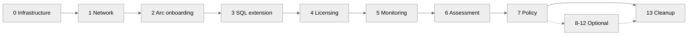

# Azure Arc-enabled SQL Server hands-on lab

Version: v1.2026.09
Last updated: 2026-09-30

A guided lab for onboarding a SQL Server instance to Azure Arc and managing it: licensing, monitoring, best practices
assessment, governance with Azure Policy, and optional preview and migration exercises. It is for IT professionals,
system administrators, and cloud architects at an intermediate level.

Plan for about 2 hours 20 minutes for the core modules and up to 1 hour 45 minutes more for the optional ones.


## What you will learn

- Deploy the Azure infrastructure for Azure Arc-enabled SQL Server with Bicep.
- Validate network access and onboard a server to Azure Arc.
- Deploy the SQL Server extension and discover instances automatically.
- Manage license types, monitoring, and the best practices assessment, and enforce it at scale with Azure Policy.
- Optionally configure updates, advanced monitoring, backups, Microsoft Entra-only authentication, and migration.

## Before you start

1. Read the [prerequisites](PREREQUISITES.md).
1. Clone the repository:

   ```powershell
   git clone https://github.com/jonathan-vella/azure-arc-enabled-sql-server.git
   cd azure-arc-enabled-sql-server/arc-sql-hands-on-lab
   ```

1. Follow the modules in order, or use the [quickstart](QUICKSTART.md) for a link-only path.
1. If a step fails, see [troubleshooting](TROUBLESHOOTING.md).

## Modules

Every module is a separate file with its own prerequisites, steps, and validation. ⚠️ marks preview features, which can
change and are not intended for production use.

### Core modules

| Module | Duration | Level | Status |
| --- | --- | --- | --- |
| [0: Infrastructure setup](modules/00-infrastructure.md) | 15 min | Beginner | GA |
| [1: Network validation](modules/01-network-validation.md) | 10 min | Beginner | GA |
| [2: Arc onboarding](modules/02-arc-onboarding.md) | 20 min | Intermediate | GA |
| [3: SQL Server extension](modules/03-sql-extension.md) | 15 min | Beginner | GA |
| [4: License management](modules/04-license-management.md) | 20 min | Intermediate | GA |
| [5: Basic monitoring](modules/05-basic-monitoring.md) | 15 min | Beginner | ⚠️ Preview |
| [6: Best practices assessment](modules/06-best-practices-assessment.md) | 20 min | Intermediate | GA |
| [7: Azure Policy for the assessment](modules/07-bpa-policy.md) | 25 min | Advanced | GA |

### Optional modules

| Module | Duration | Level | Status |
| --- | --- | --- | --- |
| [8: Automatic updates](modules/08-automatic-updates.md) | 10 min | Intermediate | GA |
| [9: Advanced monitoring](modules/09-advanced-monitoring.md) | 20 min | Advanced | ⚠️ Preview |
| [10: Backups and point-in-time restore](modules/10-backups-pitr.md) | 40 min | Advanced | ⚠️ Preview |
| [11: Disable SQL authentication](modules/11-disable-sql-auth.md) | 15 min | Intermediate | GA |
| [12: Migration assessment and portal migration](modules/12-migration.md) | 20 min | Intermediate | GA |

Module 11 needs SQL Server 2025 on Windows. Module 12 can create billable resources if you choose to migrate a database.

### Finish

| Module | Duration |
| --- | --- |
| [13: Cleanup](modules/13-cleanup.md) | 10 min |

The former Module 11 (lab cleanup) is now Module 13. Modules 0 to 10 keep their numbers.

## Lab flow


```mermaid
%%{init: {'theme':'neutral'}}%%
flowchart LR
    A[0 Infrastructure] --> B[1 Network]
    B --> C[2 Arc onboarding]
    C --> D[3 SQL extension]
    D --> E[4 Licensing]
    E --> F[5 Monitoring]
    F --> G[6 Assessment]
    G --> H[7 Policy]
    H -.-> I[8-12 Optional]
    H --> J[13 Cleanup]
    I -.-> J
```

## Resources

- [Azure Arc-enabled SQL Server documentation](https://learn.microsoft.com/sql/sql-server/azure-arc/overview?view=sql-server-ver17)
- [Azure Arc Jumpstart](https://azurearcjumpstart.io/)
- [Report a lab issue](https://github.com/jonathan-vella/azure-arc-enabled-sql-server/issues)
