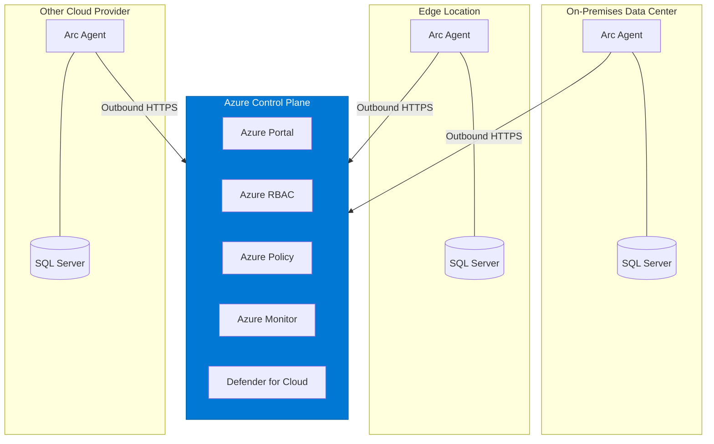

# Why Azure Arc for SQL Server?

Version: v1.2025.12
Last updated: 2025-12-16

Azure Arc extends Azure's management capabilities to SQL Server instances running anywhere—on-premises data centers, edge locations, or other cloud providers. This document explains the business and technical value of Azure Arc-enabled SQL Server for organizations at every level.

## Executive Summary

**For CIOs and CFOs**: Azure Arc-enabled SQL Server provides a unified control plane for your entire SQL Server estate, regardless of where instances run. This translates to:

- **Reduced operational complexity** through centralized management, eliminating the need for disparate tools across environments
- **Flexible licensing options** including pay-as-you-go billing that aligns costs with actual usage rather than upfront capital expenditure
- **Extended value from existing investments** by enabling Extended Security Updates (ESUs) for SQL Server 2012 and later versions past end-of-support
- **Improved security posture** with integrated threat protection, modern authentication, and unified governance

**The bottom line**: Azure Arc bridges the gap between cloud-native agility and the reality of hybrid infrastructure, enabling your organization to modernize at its own pace while maintaining control and visibility.

---

## Benefits by Role

### IT Managers and Architects

| Challenge | How Azure Arc Helps |
|-----------|---------------------|
| Managing SQL across multiple environments | Single pane of glass in Azure portal for all SQL instances |
| Inconsistent tooling and processes | Unified Azure management APIs, policies, and automation |
| Capacity and inventory visibility | Automatic discovery and detailed inventory with database metadata |
| Migration planning complexity | Built-in migration assessment with Azure SQL recommendations |
| License compliance tracking | Centralized license management with billing visibility |

**Key capabilities for IT leadership**:
- **Azure Resource Graph queries** across your entire SQL estate for reporting and governance
- **Azure Policy** enforcement for consistent configuration baselines
- **Role-based access control (RBAC)** with Azure's identity platform
- **Tag-based organization** for cost allocation and resource grouping

### Database Administrators

| Challenge | How Azure Arc Helps |
|-----------|---------------------|
| Performance troubleshooting across sites | Centralized monitoring dashboards with performance metrics |
| Configuration drift and best practices | Automated Best Practices Assessment with remediation guidance |
| Backup management complexity | Automated backups to local or network storage (preview) |
| Recovery scenarios | Point-in-time restore capabilities (preview) |
| Security hardening | Integrated vulnerability assessments and recommendations |

**Key capabilities for DBAs**:
- **Performance monitoring** with built-in Azure portal dashboards
- **Best Practices Assessment** with scheduled scans and KQL-based analysis
- **Automated discovery** of all SQL instances and databases on Arc-enabled servers
- **Extension-based feature deployment** without manual agent installations

### Security Officers and Compliance Teams

| Challenge | How Azure Arc Helps |
|-----------|---------------------|
| Visibility into SQL security posture | Microsoft Defender for Cloud integration |
| Identity and access management | Microsoft Entra ID authentication support |
| Data governance requirements | Microsoft Purview integration for unified governance |
| Vulnerability management | Automated vulnerability scanning and threat detection |
| Privilege escalation risks | Least privilege operation mode |

**Key capabilities for security teams**:
- **Defender for SQL** threat protection and vulnerability assessment
- **Microsoft Entra authentication** for centralized identity management
- **Azure RBAC** for granular access control without local account sprawl
- **Unified audit logging** through Azure Monitor and Log Analytics

---

## Key Differentiators

### 1. True Hybrid Management

Unlike tools that require full migration to the cloud, Azure Arc meets you where you are. Your SQL Server instances remain on-premises or in your chosen environment while gaining Azure management capabilities.

```
┌─────────────────────────────────────────────────────────────┐
│                    Azure Control Plane                       │
│  ┌─────────┐  ┌─────────┐  ┌─────────┐  ┌─────────┐        │
│  │ Portal  │  │  RBAC   │  │ Policy  │  │ Monitor │        │
│  └────┬────┘  └────┬────┘  └────┬────┘  └────┬────┘        │
└───────┼────────────┼────────────┼────────────┼──────────────┘
        │            │            │            │
        ▼            ▼            ▼            ▼
   ┌─────────┐  ┌─────────┐  ┌─────────┐  ┌─────────┐
   │On-Prem  │  │  Edge   │  │  Other  │  │  Azure  │
   │   DC    │  │  Site   │  │  Cloud  │  │   VMw   │
   └─────────┘  └─────────┘  └─────────┘  └─────────┘
```

### 2. Flexible Licensing Without Lock-In

- **Pay-as-you-go (PAYG)**: Convert CapEx to OpEx with hourly billing
- **License mobility**: Bring existing Software Assurance licenses
- **ESU through Arc**: Access Extended Security Updates without traditional ESU purchases

### 3. Security Without Compromise

Azure Arc doesn't require opening inbound firewall ports. The Arc agent initiates outbound connections only, maintaining your security perimeter while enabling cloud management.

### 4. Incremental Adoption

Start with inventory visibility, add monitoring when ready, enable security features progressively—Azure Arc supports your modernization journey at your own pace.

---

## Architecture Overview



The architecture enables:
- **Outbound-only connectivity** from your environment to Azure
- **Local agent processing** for data collection and feature execution
- **Azure-based management** for policies, monitoring, and governance
- **Unified identity** through Microsoft Entra ID integration

> 📊 **See [All Architecture Diagrams](diagrams.md)** for detailed visuals including security integration, licensing models, and data flow.

---

## Next Steps

| Document | Description |
|----------|-------------|
| [Architecture Diagrams](diagrams.md) | Visual diagrams of management, security, and licensing architectures |
| [Business Case](business-case.md) | Detailed analysis of operational and cost benefits |
| [Use Cases](use-cases.md) | Real-world scenarios and implementation patterns |
| [Security Benefits](security-benefits.md) | Deep dive into security and compliance capabilities |

---

## Learn More

- [SQL Server enabled by Azure Arc - Overview](https://learn.microsoft.com/en-us/sql/sql-server/azure-arc/overview)
- [Azure Arc documentation](https://learn.microsoft.com/en-us/azure/azure-arc/)
- [Hands-on Lab](../arc-sql-hands-on-lab/) - Try Azure Arc-enabled SQL Server in a guided environment
