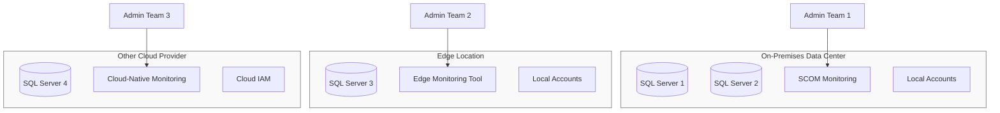
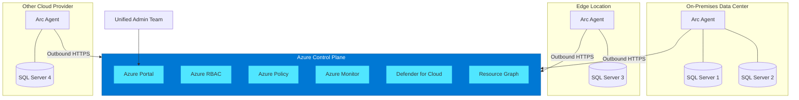
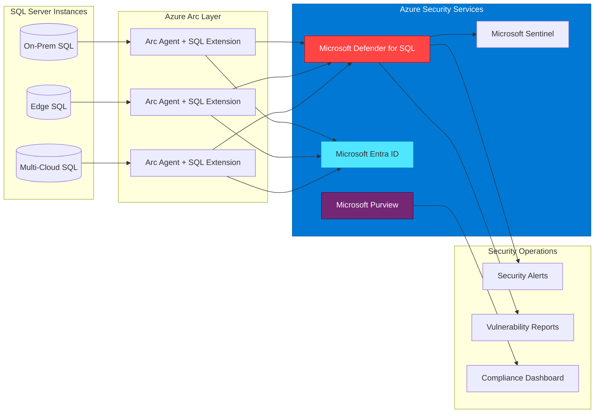
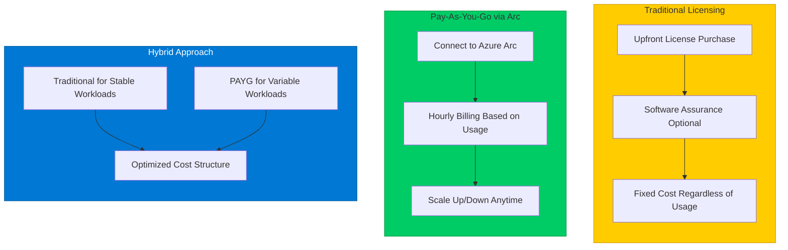
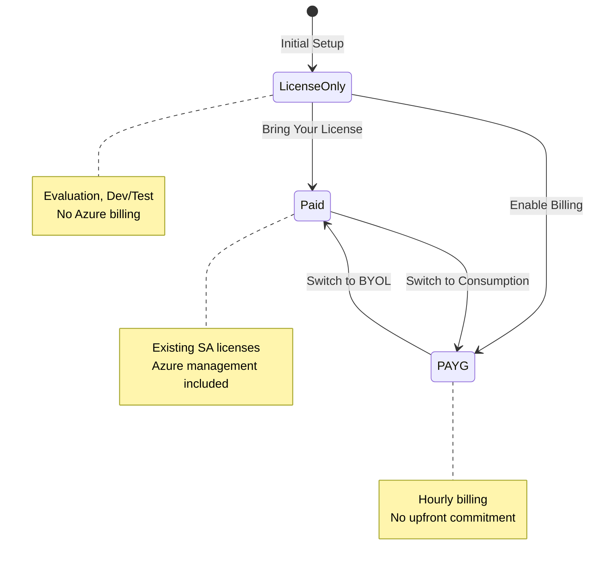
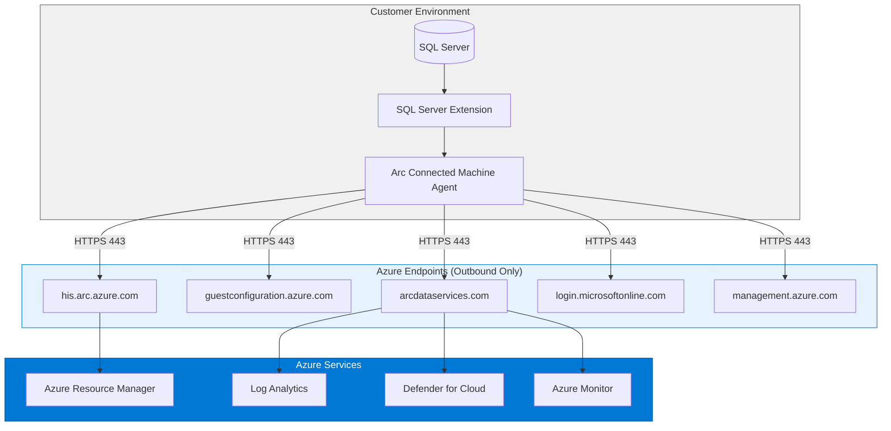
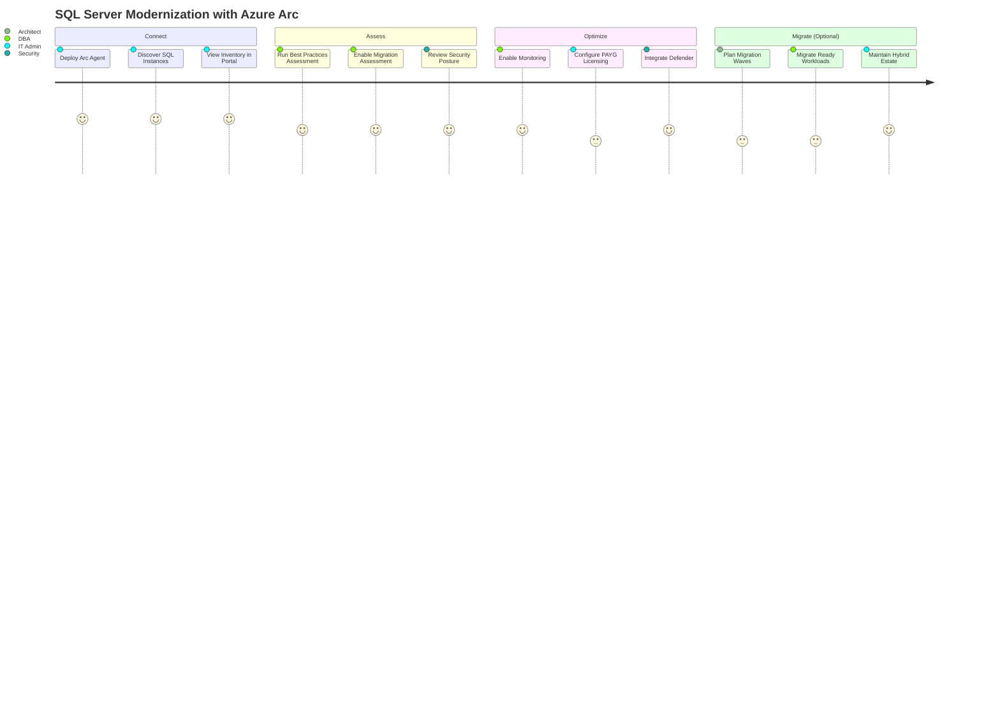

# Azure Arc-enabled SQL Server Architecture Diagrams

Version: v1.2025.12
Last updated: 2025-12-16

This document contains architecture diagrams illustrating the value and capabilities of Azure Arc-enabled SQL Server.

---

## Management Architecture: Before and After Azure Arc

### Before: Fragmented Management

**Challenges:**
- Multiple monitoring tools with no unified view
- Separate identity systems per environment
- Manual inventory and compliance tracking
- Inconsistent security policies

---

### After: Unified Azure Control Plane

**Benefits:**
- Single pane of glass for all SQL instances
- Unified identity with Microsoft Entra ID
- Automated inventory via Resource Graph
- Consistent policies across all environments

---

## Security Integration Architecture

**Security capabilities:**
- **Defender for SQL**: Threat detection, vulnerability assessment, anomaly alerts
- **Microsoft Entra ID**: Centralized authentication, MFA, conditional access
- **Microsoft Purview**: Data discovery, classification, governance policies
- **Microsoft Sentinel**: SIEM integration for security event correlation

---

## Licensing Model Comparison

---

## License Type Transitions

---

## Data Flow Architecture

**Key points:**
- All connections are **outbound only** (no inbound firewall rules required)
- Communication over **HTTPS port 443**
- Data stays in customer environment; only metadata and telemetry sent to Azure
- Supports proxy servers and private endpoints

---

## Modernization Journey

---

## Feature Availability by Environment

```mermaid
flowchart LR
    subgraph Features["Azure Arc Features"]
        Inventory[Inventory & Discovery]
        BPA[Best Practices Assessment]
        Migration[Migration Assessment]
        Monitoring[Performance Monitoring]
        Defender[Defender for SQL]
        PAYG[PAYG Licensing]
        ESU[Extended Security Updates]
        Entra[Entra ID Auth]
    end
    
    subgraph Environments["All Environments"]
        OnPrem[On-Premises]
        Edge[Edge Sites]
        MultiCloud[Other Clouds]
        AVS[Azure VMware Solution]
    end
    
    Features --> Environments
    
    style Features fill:#0078d4,stroke:#005a9e,color:#fff
    style Environments fill:#00cc66,stroke:#009944,color:#fff
```

**Consistent capabilities across:**
- On-premises data centers
- Edge and branch locations
- AWS, GCP, or other cloud providers
- Azure VMware Solution

---

*These diagrams render automatically in GitHub, Azure DevOps, and other Markdown viewers that support Mermaid.*
