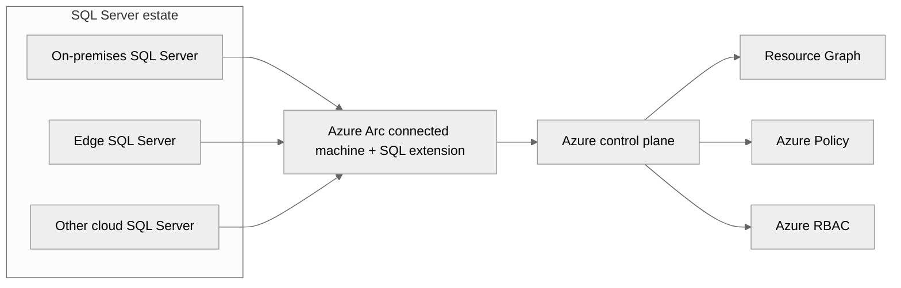
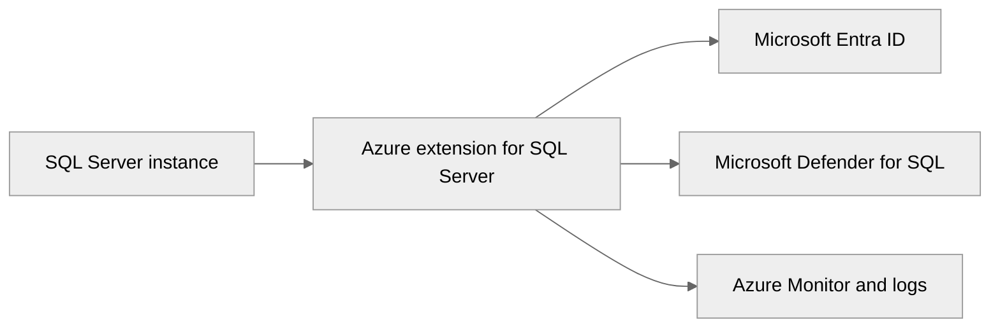
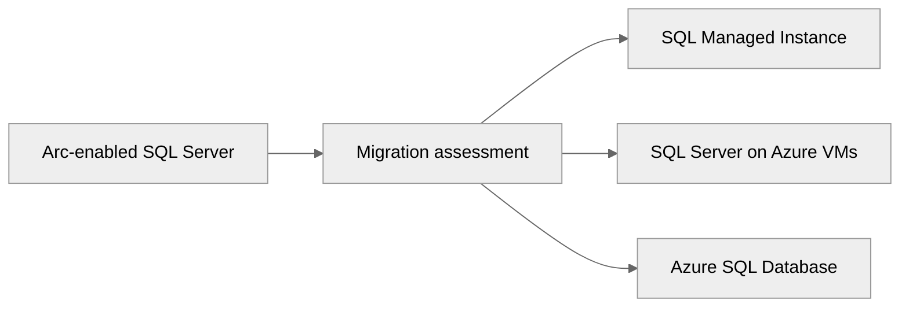
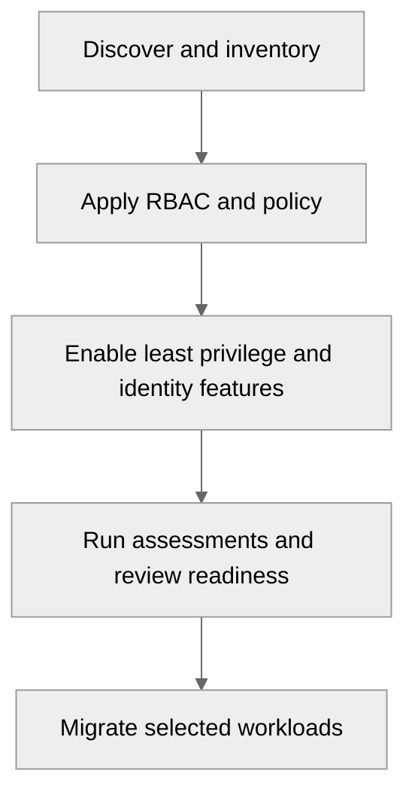

# Architecture diagrams for SQL Server enabled by Azure Arc
Version: v1.2026.09
Last updated: 2026-09-30

Use these diagrams in docs or presentations. They match the current feature status on 2026-09-30.

## Unified management

```mermaid
%%{init: {'theme':'neutral'}}%%
flowchart LR
    subgraph Estate["SQL Server estate"]
        OnPrem["On-premises SQL Server"]
        Edge["Edge SQL Server"]
        Other["Other cloud SQL Server"]
    end
    Arc["Azure Arc connected machine + SQL extension"]
    Azure["Azure control plane"]
    Graph["Resource Graph"]
    Policy["Azure Policy"]
    Rbac["Azure RBAC"]

    OnPrem --> Arc
    Edge --> Arc
    Other --> Arc
    Arc --> Azure
    Azure --> Graph
    Azure --> Policy
    Azure --> Rbac
```

This is the core value of Arc SQL. The servers stay where they are, but their SQL resources show up in Azure.

## Security and identity flow

```mermaid
%%{init: {'theme':'neutral'}}%%
flowchart LR
    Sql["SQL Server instance"]
    Ext["Azure extension for SQL Server"]
    Entra["Microsoft Entra ID"]
    Defender["Microsoft Defender for SQL"]
    Logs["Azure Monitor and logs"]

    Sql --> Ext
    Ext --> Entra
    Ext --> Defender
    Ext --> Logs
```

Least privilege is now the default for the extension. Managed identity is GA. Disabling SQL authentication is GA
for SQL Server 2025 on Windows.

## Migration path

```mermaid
%%{init: {'theme':'neutral'}}%%
flowchart LR
    Source["Arc-enabled SQL Server"]
    Assess["Migration assessment"]
    Mi["SQL Managed Instance"]
    Vm["SQL Server on Azure VMs"]
    Db["Azure SQL Database"]

    Source --> Assess
    Assess --> Mi
    Assess --> Vm
    Assess --> Db
```

Migration assessment is GA. Portal migration to SQL Managed Instance and to SQL Server on Azure VMs is GA. Azure SQL
Database remains a preview target.

## Feature rollout

```mermaid
%%{init: {'theme':'neutral'}}%%
flowchart TB
    Discover["Discover and inventory"]
    Govern["Apply RBAC and policy"]
    Secure["Enable least privilege and identity features"]
    Assess["Run assessments and review readiness"]
    Migrate["Migrate selected workloads"]

    Discover --> Govern --> Secure --> Assess --> Migrate
```

Use this order in the lab and in production. It keeps the first rollout small and makes later feature choices easier.

## Related docs

- [Why use Arc SQL](README.md)
- [Use cases](use-cases.md)
- [Security benefits](security-benefits.md)
- [Hands-on lab](../arc-sql-hands-on-lab/README.md)
